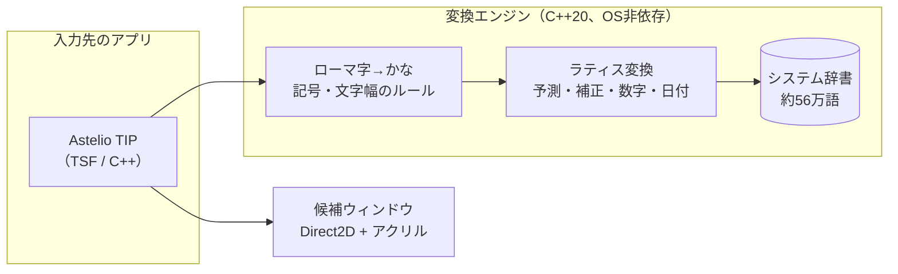

<div align="center">

# ✦ Astelio IME

**英語配列キーボードのための、新しい日本語入力。**

左Altで英語、右Altで日本語。英字は未確定のまま、かなと混ぜて変換。<br>
すりガラスの候補ウィンドウ、入力中からの予測、入力ミスの補正まで、手元の端末だけで動きます。

[](https://github.com/geekfujiwara/japanese-input/actions/workflows/ci.yml)
[](LICENSE)


</div>

---

## 特長

| | |
| --- | --- |
| ⌨️ **英語配列のための操作** | 左Altの単押しで英語、右Altの単押しで日本語。Altの単押しでアプリのメニューが開くことはありません |
| 🔤 **英字も未確定のまま** | Shift+英字は半角の未確定文字になり、`iPhoneを買う` のようにかなと一緒に変換できます |
| 🧠 **自前の変換エンジン** | 単語コストと品詞の連接コストで最適な区切りを探すラティス変換（C++20）。10〜20文字の文を0.1〜0.3ミリ秒で変換 |
| 🔮 **入力中から予測** | かな2文字から候補を表示。Tabで選んでEnterで確定 |
| 🩹 **入力ミスの補正** | `たっっせい` と打っても第1候補は `達成`。重なった「っ」「ん」「ー」などを補正した候補を出します |
| 🪟 **すりガラスの候補ウィンドウ** | 背後をぼかすアクリル背景と角丸。ライト/ダーク、透明効果オフ、ハイコントラストにも対応 |
| 🔢 **数字・日付・記号** | `1234` → １２３４ / 千二百三十四 / 1,234、`きょう` → 2026/09/25 / 令和8年9月25日、`にっこり` → 😄 |
| 🔒 **プライバシー** | IMEと変換は外部と通信しません。入力内容をログに書きません |

## キー操作

| キー | 入力中 | 変換中 |
| --- | --- | --- |
| `Space` | 変換 | 次の候補（2回目で候補ウィンドウ） |
| `Enter` | 確定 | 確定 |
| `Esc` / `BackSpace` | 取り消し / 1文字削除 | 変換前のかなに戻る |
| `Tab` / `↓` | 予測候補を選ぶ | 次の候補 |
| `←` `→` | カーソル移動 | 文節の移動 |
| `Shift` + `←` `→` | — | 文節の伸縮 |
| `1`〜`9`、`PageUp` / `PageDown` | — | 候補ウィンドウで選択、ページ送り |
| `F6`〜`F10` | ひらがな / カタカナ / 半角カタカナ / 全角英数 / 半角英数 | 注目文節に適用 |
| 左 `Alt` / 右 `Alt` の単押し | 英語 / 日本語に切り替え（未確定文字列は確定） | 同左 |
| `z` + `h` `j` `k` `l` | `←` `↓` `↑` `→`（`z-` 〜、`z.` …、`z,` ‥、`z/` ・、`z[` 『、`z]` 』） | — |

未確定のかなは点線、変換中の文節は実線、注目している文節は太線で表示します。

## しくみ



- **TIP（Text Services Framework）**: Windowsの正規の入力方式として動作し、ARM64・x64・x86のDLLを用意します
- **Core**: ローマ字変換、未確定文字列、かな漢字変換、予測、入力ミスの補正。macOS版でも同じものを使います
- **辞書**: [azooKey_dictionary_storage](https://github.com/azooKey/azooKey_dictionary_storage)（Apache-2.0）を独自の形式に変換。読み込み時にすべての範囲を検証し、壊れたファイルでも落ちません

## 試してみる（Windows）

CIが作ったTIPと辞書を取得して、管理者のPowerShellで登録します。

```powershell
./tools/Get-AstelioTip.ps1                            # mainの最新のビルドを取得（通常のPowerShellでよい）
./tools/Register-AstelioTip.ps1 -Path artifacts/tip   # 管理者のPowerShellで登録（解除は -Unregister）
```

登録後、［設定］→［時刻と言語］→［言語と地域］→［日本語］→［言語のオプション］→［キーボード］で「Astelio IME」を追加します。起動中のアプリは再起動してください（サインアウトして入り直すのが確実です）。

> [!NOTE]
> ARM64版Windowsのx64アプリには、まだ対応していません（ARM64Xの転送DLLを用意する予定です）。

## ビルド

```powershell
cmake --preset windows-arm64      # windows-x64 / windows-x86 / macos-universal
cmake --build --preset windows-arm64
ctest --preset windows-arm64
```

TIPの結合テスト（登録を伴う）は `ASTELIO_TIP_INTEGRATION=1` のときだけ動きます。CIでは常に実行します。

| ディレクトリ | 内容 |
| --- | --- |
| [core/](core) | 変換エンジン（C++20） |
| [platform/windows/tip/](platform/windows/tip) | Windows TIP（TSF） |
| [dictionary/tools/](dictionary/tools) | 辞書の変換・作成・確認ツール |
| [docs/](docs) | [計画書](docs/astelio-ime-plan.md)、[テスト計画書](docs/astelio-ime-test-plan.md) |
| [src/](src)、[tests/](tests) | 旧版（キーフック方式、.NET）。設定アプリとして作り直す予定 |

## ロードマップ

- [x] フェーズ0〜1: 開発環境、ローマ字変換・未確定文字列（Core）
- [x] フェーズ2: Windows TIP（入力、左右Alt、モード表示、登録）
- [x] フェーズ3: かな漢字変換、候補ウィンドウ、予測、F6〜F10、数字・日付、入力ミスの補正
- [ ] フェーズ3の残り: 評価コーパスでの正解率・性能の計測
- [ ] フェーズ4: 変換サーバー（アプリ間での学習の共有、アプリを巻き込まない）
- [ ] フェーズ5: 学習、ユーザー辞書、ローカルの言語モデルによる辞書の自動補強
- [ ] フェーズ6〜8: 設定アプリ、macOS版、インストーラーと署名

## ライセンス

Copyright © 2026 Geek Fujiwara — [MIT License](LICENSE)

同梱する第三者のデータとその条件は [THIRD_PARTY_NOTICES](THIRD_PARTY_NOTICES) にまとめています。
