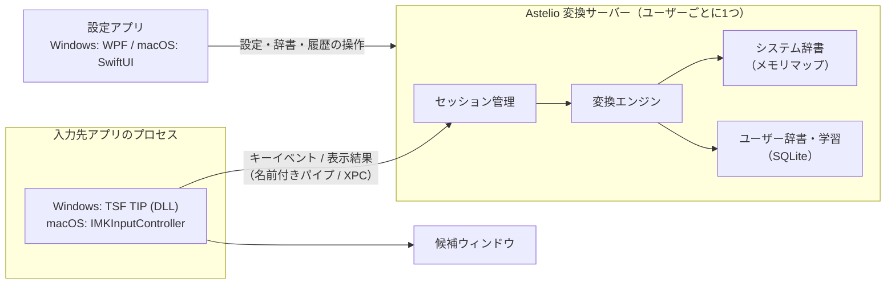
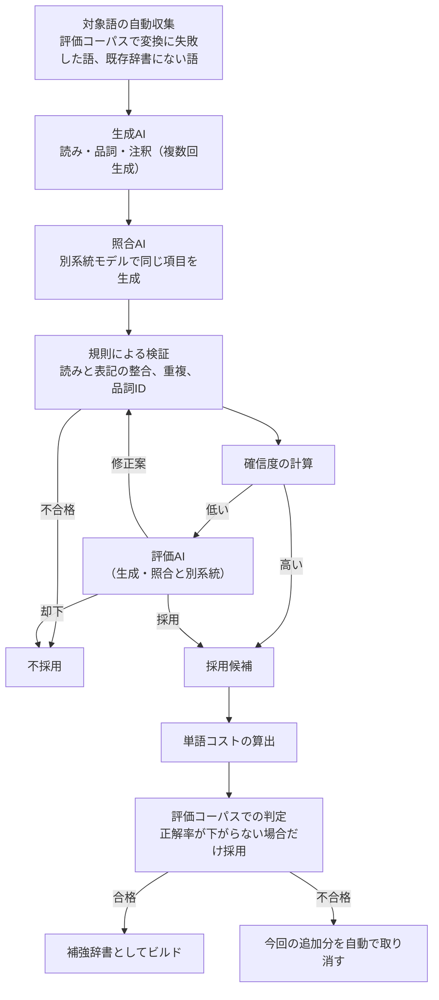

# Astelio IME 開発計画

## 1. 目的

英語配列キーボード向けの日本語入力システムとして、Astelio IMEを独自に開発する。対象はWindowsとmacOS。

現在の方式は、低レベルキーフックでキーを受け取り、変換をMS-IMEに任せている。この方式には次の構造的な限界がある。

- 半角英数字を未確定のまま保持できない（MS-IMEの半角英数モードでは入力が即時確定される）
- 未確定を維持すると英数字・記号が全角になる
- Altキーの抑制や入力モードの状態がアプリ側とずれやすい
- macOSで使えない

そこで、OS標準の入力メソッド基盤（Windows: TSF、macOS: InputMethodKit）上に独自の変換エンジンを載せる方式へ移行する。

## 2. スコープ

### 対象

| 項目 | 内容 |
| --- | --- |
| OS | Windows 11（ARM64 / x64）、macOS 13以降（Apple Silicon / Intel） |
| キーボード | 英語配列（US ANSI / ISO、macOS「ABC」「U.S.」） |
| 入力方式 | ローマ字入力 |
| 言語 | 日本語（かな漢字変換） |

### 対象外

- 日本語配列（JIS）キーボード。JIS固有キー（変換・無変換・かな・英数・¥など）は扱わない
- かな入力（JISかな配列）
- Windows 10、macOS 12以前
- モバイルOS

### 方針の変更点

- 「変換エンジンはMS-IMEを利用する」という初期方針は撤回する。macOS対応と未確定状態の完全な制御のため、変換は独自エンジンで行う
- 既存のWPFアプリ（設定・トレイ常駐・初回ウィザード）は、Windows版の設定アプリとして再利用する
- 低レベルキーボードフックは廃止する

## 3. 要件

### 3.1 これまでの要件（引き継ぎ）

| ID | 要件 |
| --- | --- |
| R-01 | 日本語モードでも英字・数字・スペース・記号は既定で半角。ただし未確定文字列として保持し、変換できる |
| R-02 | Shiftで入力する記号（`+` `(` `)` `!` `?` など）が正しく入力できる |
| R-03 | 左Alt単押しで英語入力、右Alt単押しで日本語入力。Alt単押しがアプリのメニューを起動しない |
| R-04 | Altを他のキーと同時に押した場合は、通常のAltとして動作する |
| R-05 | `「」！？・。` などを半角にするか選べる（既定は全角） |
| R-06 | タスクトレイ（macOSはメニューバー）に常駐する |
| R-07 | OS起動時に自動起動できる |
| R-08 | 初回起動時にセットアップウィザードを表示する |
| R-09 | ARM64 / x64 の配布物を用意する（MITライセンス、作者 Geek Fujiwara） |

### 3.2 IMEの基本機能

| ID | 機能 |
| --- | --- |
| B-01 | ローマ字→ひらがな変換（未確定表示、下線、カーソル移動、BackSpace/Delete） |
| B-02 | Spaceでかな漢字変換。文節区切り、文節の伸縮（Shift+←/→）、文節間の移動 |
| B-03 | 候補ウィンドウ。候補番号の選択、ページ送り、注釈（用法・同音異義語の説明） |
| B-04 | 予測変換（入力途中で候補を表示）。Tabで選択 |
| B-05 | F6〜F10でひらがな・カタカナ・半角カナ・全角英数・半角英数に変換 |
| B-06 | Enterで確定、Escで取り消し、一部確定 |
| B-07 | 再変換（確定済み文字列の選択から変換し直す） |
| B-08 | 確定取り消し（直後のUndo） |
| B-09 | 数字変換（漢数字、全角、桁区切り）、日付・時刻変換（「きょう」「いま」など） |
| B-10 | 記号・絵文字・顔文字の変換（「やじるし」→「→」など） |
| B-11 | パスワード入力欄では無効化（WindowsはInputScope、macOSはSecure Input） |
| B-12 | 入力モード表示（あ / A）。モード切替時に一時的に表示 |

### 3.3 カスタマイズ

| ID | 機能 |
| --- | --- |
| C-01 | 記号ごとの入力モード設定。各記号について「半角」「全角」「和文記号」から選ぶ（例: `[` → `「` / `［` / `[`） |
| C-02 | 句読点のスタイル（`、。` / `，．` / `,.` / `、．`） |
| C-03 | 英字・数字・スペースの半角/全角を個別に設定 |
| C-04 | ローマ字テーブルの編集（追加・削除・インポート・エクスポート）。AZIKなどの拡張入力も定義できる |
| C-05 | キー割り当ての編集。プリセット（MS-IME風、ATOK風、ことえり風）を用意 |
| C-06 | 修飾キー単押しの割り当て。Windowsは左右Alt、macOSは左右Command（どちらも変更可能） |
| C-07 | 候補ウィンドウの表示件数、フォント、サイズ、配色、縦/横 |
| C-08 | 予測変換の有効/無効、表示までの文字数、候補数 |
| C-09 | アプリごとの設定（初期モード、無効化） |
| C-10 | 設定のインポート・エクスポート（別PCへの移行用） |

### 3.4 辞書と学習

| ID | 機能 |
| --- | --- |
| D-01 | システム辞書（読み・表記・品詞・コスト） |
| D-02 | ユーザー辞書の追加・編集・削除・検索 |
| D-03 | ユーザー辞書のインポート・エクスポート（Google日本語入力、MS-IME、ATOK、ことえりのテキスト形式、独自JSON） |
| D-04 | 自動学習（選んだ候補の順位、文節区切り、よく使う連続した語、予測候補） |
| D-05 | 学習履歴の閲覧、個別削除、期間を指定した削除、全削除 |
| D-06 | 学習の一時停止（シークレットモード）。アプリ単位でも設定できる |
| D-07 | 辞書の追加（専門用語など）。有効/無効、優先度を設定できる |
| D-08 | 抑制語の登録（特定の候補を表示しない） |

### 3.5 非機能要件

| 項目 | 目標 |
| --- | --- |
| キー入力から表示まで | 16ms以内（p95） |
| 変換（10文字程度） | 30ms以内（p95） |
| 常駐メモリ | 150MB以下 |
| 起動 | 初回キー入力までに辞書を読み込み済み（メモリマップで遅延読み込み） |
| 障害時 | 変換サーバーが落ちてもアプリを巻き込まない。自動で再起動する |
| プライバシー | 入力内容を外部に送信しない。学習データは端末内に保存する |
| 変換精度 | 独自の評価コーパスで文単位の正解率を測る。リリース時の目標値は評価基盤ができた段階で決める |

## 4. アーキテクチャ

### 4.1 全体構成



### 4.2 各部の役割

| 部品 | 役割 | 言語 |
| --- | --- | --- |
| Core（変換エンジン） | ローマ字変換、未確定文字列の管理、かな漢字変換、予測、学習、記号ルール | C++20（OS依存なし） |
| 変換サーバー | Coreをプロセスとして動かす。複数アプリからのセッションを管理し、学習を一か所に集める | C++20 |
| Windows TIP | TSFに登録するDLL。キー処理、未確定表示、候補ウィンドウ、モード表示 | C++20（COM / TSF） |
| macOS 入力メソッド | InputMethodKitのアプリ。キー処理と表示 | Swift + Objective-C++（Coreとの橋渡し） |
| 設定アプリ（Windows） | 既存WPFアプリを改修 | C# / .NET 10 |
| 設定アプリ（macOS） | 設定、辞書、履歴の管理 | SwiftUI |

### 4.3 変換サーバーを別プロセスにする理由

TIPは入力先アプリのプロセス内で動く。変換エンジンを同じプロセスに置くと次の問題がある。

- アプリごとに辞書を読み込み、メモリを消費する
- 学習結果がアプリ間で共有されない
- エンジンの不具合で入力先アプリが落ちる
- Windowsでは、x64エミュレーションのアプリ、ARM64のアプリ、32bitのアプリそれぞれにエンジンを載せる必要がある

別プロセスにすれば、TIPは薄い層になり、エンジンはネイティブアーキテクチャのサーバー1つで済む。

通信経路はユーザー本人のみがアクセスできるようにする（Windowsは名前付きパイプのACL、macOSはXPCのコード署名チェック）。メッセージはサイズ上限と形式を検証する。

### 4.4 変換エンジンの設計


- 辞書: 読みをキーにしたコンパクトなトライ（LOUDSまたはダブル配列）。ファイルをメモリマップして読み込む
- 言語モデル: 品詞の連接コスト行列＋単語コスト。後で単語の2-gramを追加する
- 未確定文字列: 文字ごとに「かな」「半角英数」「全角英数」「記号」の属性を持つ。R-01の半角英数と、かな混在の変換（例: `iPhoneをかう`）はここで扱う
- 記号ルール: C-01の設定を、ローマ字変換の直後に適用する
- 学習: システム辞書は書き換えない。学習結果は別レイヤーに保存し、変換時にコストを補正する
- 予測: 入力中の読みを前方一致で検索し、ユーザー履歴＋システム辞書から候補を出す

### 4.5 辞書データ

変換精度は辞書と言語モデルの質で決まる。Astelio IME本体はMITライセンスで提供する。同梱する第三者のコード・データは、MITを優先し、MITの配布物に含められるライセンス（Apache-2.0、BSD系）に限る。

| 候補 | 用途 | ライセンス（2026-09-24確認） | 注意 |
| --- | --- | --- | --- |
| AzooKeyKanaKanjiConverter | 変換エンジンの参考実装。macOS版では直接利用も検討 | MIT | Swift製。Windows版のC++ Coreには設計を参考にする |
| azooKey_dictionary_storage | システム辞書、連接コスト | Apache-2.0 | 6列TSV（読み・表記・左品詞ID・右品詞ID・意味ID・スコア）。LICENSEとNOTICEの同梱が必要 |
| SudachiDict | 語彙の補強 | Apache-2.0 | 表記と品詞体系の変換が必要 |
| Mozcのオープンソース辞書 | 比較・評価用 | IPAdic・沖縄辞書由来の独自ライセンス（MITではない） | 同梱は保留。使う場合は著作権表示の同梱条件を満たす |
| 独自の固有名詞・新語リスト | 流行語、製品名 | 自作（MIT） | 収集方法と権利を確認する |
| 言語モデルで生成した補強辞書 | 新語、IT用語、英字混じりの語、注釈 | 自作（MIT） | 生成に使うモデルはMIT・Apache-2.0に限る（4.5.3） |

GPL系の辞書（SKK辞書の一部など）はMITと両立しないため、同梱しない。ユーザーが自分で追加辞書として取り込む機能（D-07）で対応する。

第三者のライセンスは `THIRD_PARTY_NOTICES` にまとめ、配布物（ZIP、インストーラー、アプリバンドル）に含める。

辞書のビルドは独立したツールにする（テキスト形式のソース → バイナリ辞書）。辞書の更新は、アプリ本体と切り離して配布できるようにする。

### 4.5.1 言語モデルによる辞書の補強

軽量な言語モデルは辞書を作る時だけに使い、結果を辞書として保存する。実行時は辞書を引くだけにし、推論のコストと遅延をなくす。手元のPCでモデルを動かすので、トークン料金はかからない。

辞書の補強は**人が一切介在しない完全自律の処理**とする。確信度の低い語は、生成・照合とは別系統の評価AIが判定する。評価AI自身の正確さも自動で測り、基準を下回ったら処理を止める。



**各AIの役割**

| 役割 | 担当 | 内容 |
| --- | --- | --- |
| 生成AI | 4.5.3の生成モデル | 読み・品詞・注釈を作る。同じ語を複数回生成し、結果のばらつきを確信度に使う |
| 照合AI | 4.5.3の照合モデル | 生成AIの結果を見ずに、同じ語の読み・品詞を独立に作る |
| 評価AI | 4.5.3の評価モデル | 確信度の低い語だけを判定する。「採用」「却下」「修正案」のいずれかと理由を、決められた形式で返す |

**確信度の計算**

次の値を組み合わせて0〜1の数値にする。

- 生成AIと照合AIの結果が一致するか（読み、品詞）
- 生成AIを複数回動かしたときに同じ結果が出る割合
- モデルが出力に付けた確率
- 作った語を辞書に入れて読みを変換したときに、正しい表記が候補に出るか（往復確認）

しきい値は手で決めず、下の「正解が分かっている確認用の語」で測った誤り率が目標（初期値 1%）以下になるように自動で調整する。

**評価AIの判定方法**

- まず生成AI・照合AIの結果を見せずに、評価AI自身に読みと品詞を答えさせる。次に両者の結果と比べさせ、判定と理由を返させる（他のAIの答えに引きずられないようにするため）
- 評価AIが出した修正案は、規則による検証と照合AIにもう一度かける。修正は1語につき1回までとし、それでも確信度が低ければ却下する
- 判定の形式（JSON）が崩れている場合は却下扱いにする

**人の確認の代わりになる自動の安全装置**

| 仕組み | 内容 |
| --- | --- |
| 確認用の語 | 既存のシステム辞書から無作為に選んだ正しい語と、読みや品詞をわざと壊した語を混ぜて、毎回の処理に目印なしで混入させる |
| 各AIの正確さの監視 | 確認用の語への判定から、生成AI・照合AI・評価AIそれぞれの正解率を測る |
| 自動停止 | いずれかの正解率が基準を下回ったら、その回の結果をすべて不採用にして処理を止める |
| 評価コーパスによる判定 | 追加する語をまとめて辞書に入れ、正解率が下がらない場合だけ採用する |
| 自動の取り消し | 採用後に評価コーパスの正解率が下がった場合は、生成記録をもとに該当分を取り消す |
| モデル変更時の再調整 | モデルやその版を変えたら、しきい値を調整し直すまで採用しない |

**実行の管理**

- 処理待ちの一覧を持ち、中断しても途中から再開できるようにする
- PCが使われていない時、AC電源の時だけ動かす。CPU・メモリの使用量に上限を設ける
- モデルは共通のAPI（OpenAI互換）で呼び出し、llama.cpp・Ollama・Foundry Localなどを差し替えられるようにする
- 出力は形式を強制する（llama.cppの文法指定など）。同じ入力から同じ結果が出るように、乱数の種と設定を記録する
- 学習履歴から対象語を集める場合は、本人の同意を得たうえで端末内だけで処理する

**記録**

- 補強辞書はシステム辞書とは別ファイルにし、有効/無効を切り替えられるようにする
- 各語に、使ったモデルの名前・版・ハッシュ、確信度、各AIの判定と理由を記録する

| 作業 | 担当 | 備考 |
| --- | --- | --- |
| 読みの付与 | 生成AI、照合AI | 一致しない場合は評価AIが判定する |
| 品詞の付与 | 生成AI、照合AI | 活用の種類は規則で検証する |
| 同音異義語の注釈 | 生成AI | 候補ウィンドウの説明に使う。評価AIが内容を確認する |
| 単語コスト | スコア用モデル | 文章で答えさせず、モデルが表記に付ける確率から計算する |
| 見出し語の網羅 | 自動収集 | モデルは知らない語を挙げられないため、変換の失敗などから対象語を集める |
| 連接コスト | 既存辞書 | azooKey_dictionary_storageのものを使う |

**エージェント型（品質で上回る場合のみ採用）**

標準は上記のワークフロー型とする。GitHub Copilot SDKを使ったエージェント型は、ワークフロー型が安定した後に試作し、品質で上回る場合だけ採用する。無理に組み込まない。

- エージェントに任せるのは、判断が必要な部分だけとする（変換に失敗した原因の分析と次の対象語の選定、確信度の低い語の追加調査、指示文の改善案）
- 統括するエージェントにはツール呼び出しが得意なモデルを使う。評価AIとは別のモデルにする
- 生成AI・照合AI・評価AIなどのSLMはツールの中から呼ぶ部品とし、エージェントの判断には使わない（小型モデルは多段階のツール呼び出しが苦手で、文脈の上限も小さいため）
- モデルは利用者側で指定する方式（BYOK）で、Ollama・Foundry Localなどのローカルサーバーにつなぐ。GitHubの認証は使わない

安全策。

- エージェントは候補を出すだけとする。辞書への書き込みは `submit_candidates` ツールだけから行い、形式の検証と採用判定（通常のプログラム）を必ず通す
- 評価コーパス・確認用の語・採用判定のプログラム・しきい値の計算は、エージェントから読み取り専用にする。ハッシュを記録し、変わっていたら実行を止める
- CLI標準のツール（ファイル編集、シェル実行など）はすべて無効にし、許可したツールだけを使えるようにする
- 1回の実行ごとに、ループの回数・1語あたりの試行回数・実行時間に上限を設ける。上限に達したら途中の結果を捨てて終了する
- SDKのイベント（ツール呼び出しと入出力）をすべて記録し、採用した語の根拠を後から追えるようにする
- 実行中に外部と通信しないことを確認する（BYOK利用時のテレメトリなど）
- 辞書作成環境は開発用のツールとし、IME本体の配布物には含めない（同梱されるCopilot CLIはGitHubの利用規約に従うため）

採用の判定。同じ対象語でワークフロー型とエージェント型を実行し、次の指標で比べる。確認用の語での誤り率が同等以下で、評価コーパスの改善幅が上回る場合だけエージェント型を採用する。

| 指標 | 内容 |
| --- | --- |
| 誤り率 | 確認用の語で測った、誤って採用した語の割合 |
| 改善幅 | 補強辞書を入れたときの評価コーパスの正解率の増加 |
| 採用数 | 採用された語の数 |
| 所要時間 | 1,000語あたりの処理時間 |
| 再現性 | 同じ入力で2回実行したときに採用結果が一致する割合 |

**開発の進め方（両方式共通）**

スキーマ、アプリケーション、ハーネスの実装はLLMで行い、入力（指示文）と出力を検証する。同じLLMが実装とテストを書くと同じ見落としが入るため、次のように分ける。

| 対象 | 進め方 |
| --- | --- |
| スキーマ | 辞書項目、ツールの入出力、評価AIの判定をJSON Schemaで先に決める。以後の実装とテストはこれに従う |
| 指示文 | 版を付けて管理する。変更のたびに確認用の語と評価コーパスで測り、悪化したら採用しない |
| 出力 | スキーマ検証と性質のテスト（読みはひらがなだけ、送り仮名が表記と一致する、など） |
| 受け入れテスト | 実装とは別のセッション・別のモデルで、仕様書から先に書く。実装中は変更しない |
| テストの有効性 | わざと不具合を入れて、テストが見つけられるかを確かめる（ミューテーションテスト） |

### 4.5.2 SLMによる文脈変換（任意機能）

辞書で作った候補を、前後の文脈に合わせてSLMが選び直す。変換そのものは辞書で行い、SLMは候補の順位付けだけを担う。

- 本体とは別に配布し、設定画面から追加できるオプションにする（本体のMIT配布物にモデルを含めない）
- 時間内（目安 30ms）に終わらなければ、辞書だけの結果を表示する
- 入力した読みと合わない候補は採用しない（読みとの照合を必ず行う）
- 推論はllama.cpp（GGUF）またはONNX Runtimeで行い、Windows ARMではNPU・GPU、macOSではMetalを使う
- パスワード欄やシークレットモードでは使わない。入力内容は端末の外に出さない

### 4.5.3 モデルの選定

選定の基準は次の3つ。

1. ライセンスがMITまたはApache-2.0で、独自の利用規約や追加条件がない（出力をMITの辞書として配布できる）
2. 日本語の性能が高い
3. 手元のPC（ARM64 / x64、16GB程度のメモリ）で動く

**候補（2026-09-24にHugging Faceのモデルページで確認）**

| モデル | 開発元 | 規模 | ライセンス | 日本語 | 役割 |
| --- | --- | --- | --- | --- | --- |
| sarashina2.2-3b-instruct-v0.1 | SB Intuitions | 3B | MIT | 日本語特化。開発元の比較では、同規模のQwen2.5-3Bやllm-jp-3-3.7bより日本語の評価が高い | **生成AIの第一候補** |
| sarashina2.2（0.5B / 1B） | SB Intuitions | 0.5B / 1B | 各モデルで要確認 | 同上の小型版 | 文脈変換（任意機能）の候補 |
| llm-jp-3-3.7b-instruct / 1.8b | 国立情報学研究所 | 3.7B / 1.8B | Apache-2.0 | 日本語の学習データが多く、内訳が公開されている | **照合AIの第一候補** |
| PLaMo 2 1B | Preferred Networks | 1B | Apache-2.0 | 日英で学習。指示調整なしのベースモデル | 単語コスト算出（確率計算）の候補。Mamba系の構造のため実行環境の対応を確認する |
| gpt-oss-20b | OpenAI | 21B（動作時 3.6B） | Apache-2.0 | 多言語。16GB程度で動作。推論の強さを調整できる | **評価AIの第一候補**（確信度の低い語だけを扱うため、処理量が少なく大きめのモデルを使える） |
| Qwen3-4B | Alibaba | 4B | Apache-2.0 | 多言語。日本語特化モデルとの差は評価で確認する | 評価AIの予備（16GBのメモリがない環境向け） |
| Phi-4-mini-instruct | Microsoft | 3.8B | MIT | 日本語に対応。ただし英語中心で他言語は性能が下がると明記 | 予備 |

**採用しないもの**

| モデル | 理由 |
| --- | --- |
| Gemma 3 | Gemma独自の利用規約 |
| TinySwallow-1.5B-Instruct | 本体はApache-2.0だが、Gemmaのデータで学習されておりGemmaの規約も守る必要がある |
| Llama系とその派生モデル | Llama独自のライセンス |
| zenz-v2.5 | かな漢字変換専用で有力だが、CC BY-SA 4.0。文脈変換を別配布にする場合のみ、利用者が選んで入れる選択肢として検討する |

**方針**

- 辞書の補強: 生成AIにsarashina2.2-3b-instruct（MIT）、照合AIにllm-jp-3-3.7b-instruct（Apache-2.0）、評価AIにgpt-oss-20b（Apache-2.0）を使う。3つとも開発元も学習データも異なるので、誤りが重なりにくい
- 文脈変換（任意機能）: 1B以下のモデルが必要。sarashina2.2の小型版を基に、かな漢字変換向けに追加学習する案を検討する。追加学習に使うデータの権利も確認する
- 日本語の評価値は開発元によるもの。最終的には、読みの付与と変換の正解率を自前の評価コーパスで比較して決める
- 採用したモデルの名前・版・ライセンスは `THIRD_PARTY_NOTICES` と辞書の生成記録に残す

### 4.6 データの保存

| データ | 形式 | 場所（Windows） | 場所（macOS） |
| --- | --- | --- | --- |
| 設定 | JSON（スキーマのバージョン付き） | `%APPDATA%\AstelioIME\settings.json` | `~/Library/Application Support/AstelioIME/settings.json` |
| ユーザー辞書 | SQLite | `%APPDATA%\AstelioIME\user.db` | 同上フォルダ |
| 学習履歴 | SQLite（WAL） | `%LOCALAPPDATA%\AstelioIME\learning.db` | 同上フォルダ |
| システム辞書 | バイナリ（読み取り専用） | インストール先 | アプリバンドル内 |

- 既存の `%LOCALAPPDATA%\AstelioIME\settings.json` は初回起動時に移行する
- 学習履歴の削除は、データベースから物理的に消す（`VACUUM` まで行う）
- 学習データはOSのユーザー保護領域に置き、必要に応じてOSの暗号化機能（Windows DPAPI、macOS Keychainで管理する鍵）を使う

### 4.7 OSごとの注意点

**Windows**

- TIPはARM64、x64、x86の3種類のDLLが必要（ARM64版Windowsでもx64アプリ・32bitアプリがそれぞれのDLLを読み込む）
- TIPの登録はHKLMへの書き込みが必要なため、管理者権限のインストーラーで行う
- 言語プロファイルは日本語（ja-JP）として登録し、キーボード配列は英語配列を前提とする
- Alt単押しはTSFのキーイベント（`ITfKeyEventSink`）と優先キー（`ITfKeystrokeMgr::PreserveKey`）で処理する。低レベルフックは使わない
- 管理者権限のアプリ、UWPアプリ、ロック画面の入力欄で動作を確認する

**macOS**

- InputMethodKitのアプリとして `~/Library/Input Methods` または `/Library/Input Methods` に配置する
- Universal 2（arm64 + x86_64）でビルドする
- WindowsのAltに当たるキーは左右Commandとする（単押しで英数/かな）。Optionにも変更できる
- Developer ID署名と公証（Notarization）が必要
- 修飾キー単押しの検出には `flagsChanged` を使う

## 5. リポジトリ構成案

```text
C:\dev\IME
├─ core/                     C++20 変換エンジン（OS依存なし）
│  ├─ include/astelio/
│  ├─ src/
│  │  ├─ composer/           ローマ字変換、未確定文字列
│  │  ├─ converter/          ラティス、経路探索、候補
│  │  ├─ dictionary/         辞書の読み込み・検索
│  │  ├─ learning/           学習、履歴
│  │  ├─ prediction/         予測変換
│  │  └─ rules/              記号・句読点・半角全角ルール
│  └─ tests/
├─ server/                   変換サーバー（IPC、セッション管理）
├─ platform/
│  ├─ windows/
│  │  ├─ tip/                TSF TIP（ARM64 / x64 / x86）
│  │  ├─ settings/           既存WPFアプリを移設
│  │  └─ installer/          WiX インストーラー
│  └─ macos/
│     ├─ AstelioInput/       InputMethodKit アプリ
│     └─ AstelioSettings/    SwiftUI 設定アプリ
├─ dictionary/
│  ├─ sources/               辞書ソース（テキスト）
│  ├─ augment/               言語モデルによる辞書補強（生成・検証・生成記録）
│  └─ tools/                 辞書ビルダー
├─ eval/                     変換精度の評価コーパスと評価ツール
├─ docs/
└─ tools/                    ビルド・配布スクリプト
```

ビルドはCMake（core、server、辞書ツール、Windows TIP）とXcode（macOS）を使う。WPF設定アプリは引き続き `dotnet` でビルドする。

## 6. 既存コードの扱い

| 既存 | 扱い |
| --- | --- |
| `KotohaIME.Core/InputNormalizer.cs` | 記号・句読点のルールをCoreの `rules` へ移植する。テストケースも移植する |
| `KotohaIME.Core/AltPressTracker.cs` | 単押し判定のロジックをCoreへ移植する（Windows TIPとmacOSで共通化） |
| `KotohaIME.Core/ImeSettings.cs` | 設定スキーマv2の元にする。旧設定からの移行処理を書く |
| `KotohaIME.App`（WPF） | 設定アプリとして残す。キーフック（`KeyboardInterceptor`）とIME制御（`ImeController`）は削除する |
| `TrayIconService`、`StartupRegistration`、`SetupWizard` | 流用する。自動起動の対象は変換サーバーに変える |
| 既存テスト（38件） | Coreに移植できるものは移植する。WPF側は設定画面のテストとして残す |
| 名前 `KotohaIME.*` | `Astelio.*` に統一する |

## 7. 開発フェーズ

各フェーズは、動くものを作ってから次に進む。

### フェーズ0: 開発環境とリポジトリ整備

- Visual Studio Build Tools（C++、ARM64 / x64 / x86）、CMake、WiXの導入
- macOS用にXcodeの環境を用意する
- リポジトリをGitで管理し、上記の構成に整理する
- CI（Windows ARM64 / x64、macOS arm64 / x86_64）を用意する

**完了条件**: 空のCoreライブラリとテストが全アーキテクチャでビルド・実行できる。

手元にC++の開発環境がない間は、GitHub ActionsのCIでビルドとテストを確認する（Windows ARM64 / x64 / x86、macOS arm64 / x86_64）。

### フェーズ1: 未確定文字列（Core）

- ローマ字テーブル（標準のテーブル＋編集可能）
- かなと半角英数記号が混在する未確定文字列
- 記号ルール（C-01〜C-03）の移植
- 単押し判定の移植

**完了条件**: `a` → `あ`、`iPhone` → `iPhone`（半角・未確定）、`+` `(` がShiftで入る、ことを単体テストで確認できる。

### フェーズ2: Windows TIP（最小構成）

- TSF TIPの登録・解除（開発用スクリプト）
- キー処理、未確定表示、Enterで確定、Escで取り消し
- 左右Alt単押しの切替（メニューが起動しないこと）
- モード表示
- この段階ではCoreをDLL内で直接呼んでよい（サーバー化はフェーズ4）

**完了条件**: メモ帳、Edge、VS Code、Wordで、半角英数を未確定のまま入力し、ひらがなと混在させて確定できる。R-01〜R-04を満たす。ここで現在のキーフック版を置き換えられる。

### フェーズ3: かな漢字変換

- 辞書ビルダーとシステム辞書
- ラティス構築と経路探索
- 文節の区切り・伸縮・移動
- 候補ウィンドウ（Windows）
- F6〜F10の変換、数字・日付変換

**完了条件**: 評価コーパスで正解率を計測できる。日常的な文章が変換できる。

### フェーズ4: 変換サーバー化

- サーバープロセス、IPC、セッション管理
- TIPを薄い層にする
- サーバーの自動起動と、落ちた場合の再起動
- x86 / x64 / ARM64 のTIPが同じサーバーにつながること

**完了条件**: 複数のアプリで同時に入力しても、学習と辞書が共有される。サーバーを強制終了しても入力先アプリが落ちない。

### フェーズ5: 学習・予測・ユーザー辞書

- 学習（候補順位、文節区切り、連語）
- 予測変換
- ユーザー辞書の追加・編集・インポート・エクスポート
- 学習履歴の閲覧・削除、シークレットモード
- 抑制語
- 言語モデルによる辞書補強のツール（4.5.1。生成・照合・評価の3つのAI、確認用の語による監視、自動停止と自動の取り消し）と、補強辞書の初版

**完了条件**: D-01〜D-08を満たす。補強辞書の有無で評価コーパスの正解率を比較できる。辞書補強が人の操作なしで最後まで実行できる。学習の有無で変換結果が変わることを自動テストで確認できる。

### フェーズ6: 設定アプリ（Windows）

- 既存WPFアプリを改修し、C-01〜C-10の画面を作る
- 辞書・学習履歴の管理画面
- 初回ウィザードの更新
- 設定変更をサーバーに即時反映

### フェーズ7: macOS版

- InputMethodKitアプリ（キー処理、未確定表示、候補ウィンドウ）
- 左右Command単押しの切替
- SwiftUIの設定アプリ
- メニューバー常駐、ログイン時の起動

**完了条件**: テキストエディット、Safari、VS Codeで、Windows版と同じ入力操作ができる。

### フェーズ8: 配布

- Windows: WiXインストーラー（TIP 3種の登録、サーバー、設定アプリ）、コード署名、アンインストール時の登録解除
- macOS: Universal 2のパッケージ、署名、公証
- 辞書の更新配布の仕組み
- 自動更新の確認機能

### フェーズ9: 品質向上とベータ版

- 変換精度の改善（辞書、コスト、学習の調整）
- 性能の計測と改善（3.5の目標値）
- 各種アプリでの互換性確認
- SLMによる文脈変換（任意機能、4.5.2）の試作と、速度・精度の評価
- 辞書作成のエージェント型（4.5.1）の試作と、ワークフロー型との比較。品質で上回らなければ採用しない
- ベータ版を配布し、変換ミスの報告を集める仕組みを用意する（入力内容は本人の操作で送る場合のみ）

## 8. テスト方針

具体的なテストケース、環境、性能目標、フェーズごとの完了条件は [astelio-ime-test-plan.md](astelio-ime-test-plan.md) にまとめる。

| 対象 | 方法 |
| --- | --- |
| Core | 単体テスト（ローマ字変換、記号ルール、単押し判定、辞書検索、経路探索、学習） |
| 変換精度 | 評価コーパス（読み→正解表記）で文単位・文節単位の正解率を計測し、CIで悪化を検知する |
| 性能 | ベンチマーク（キー処理、変換、予測、起動時間）をCIで計測する |
| 入力の頑健性 | ファジング（ランダムなキー列でクラッシュしないこと、IPCメッセージの不正値） |
| Windows TIP | テスト用アプリにTIPを読み込み、TSF経由でキーを送って未確定文字列と確定文字列を検証する。Alt単押しでメニューが起動しないことも検証する |
| macOS | XCTest（入力コントローラーの単体テスト）、UIテスト |
| 設定アプリ | 画面の操作テスト、設定の保存と移行のテスト |
| 手動確認 | 対象アプリの一覧を作り、リリースごとに確認する |

これまでの不具合（Altでメニューが起動する、半角が即時確定される、右Alt後に英語に戻る）は、すべて自動テストとして残す。

## 9. リスクと対策

| リスク | 影響 | 対策 |
| --- | --- | --- |
| 変換精度が大手IMEに届かない | 利用者が定着しない | 評価基盤を先に作り、改善を数値で追う。学習と英語配列向けの操作性で差をつける |
| 辞書・コーパスのライセンス | 配布できない | 本体はMIT。同梱物はMIT・Apache-2.0・BSD系に限り、`THIRD_PARTY_NOTICES` で管理する。GPL系は同梱しない |
| 言語モデルが誤った読み・品詞を生成する | 誤変換が辞書に固定される | 別系統の照合AIと評価AI、規則による検証、評価コーパスによる判定。生成記録をもとに自動で取り消す |
| 3つのAIがそろって同じ誤りをする（人の確認がないため気づけない） | 誤りが辞書に入る | 開発元・学習データの異なるモデルを選ぶ。確認用の語で各AIの正確さを毎回測り、基準を下回ったら自動で止める |
| モデルのライセンス変更 | 生成物の扱いが変わる | 利用時点のライセンスと版を生成記録に残す |
| TSFの互換性（アプリごとの挙動差） | 一部アプリで入力できない | 対象アプリの一覧で確認する。問題のあるアプリ用の回避設定を用意する |
| Windowsのアーキテクチャ混在 | x64・32bitアプリで使えない | TIPを3種ビルドし、CIで全種を確認する |
| コード署名・公証の費用と手続き | 配布できない、警告が出る | フェーズ8より前に証明書とApple Developer Programを用意する |
| 学習データの漏えい | プライバシー侵害 | 外部に送信しない。ユーザー領域に保存し、削除を確実に行う。パスワード欄では学習しない |
| 開発規模が大きい | 完成が遅れる | フェーズ2でキーフック版を置き換え、早い段階で日常利用できる状態にする |

## 10. 決めておくこと

開発を始める前、または該当フェーズまでに決める。

1. システム辞書に使うデータ（第一候補: azooKey_dictionary_storage。4.5参照）
2. macOSで単押しに使うキーの既定値（Command / Option）
3. Windowsのインストーラー形式（MSI / MSIX）。TIPの登録にはMSIが扱いやすい
4. コード署名証明書の入手方法
5. 変換ミスの報告機能を設けるか、設ける場合の同意の取り方
6. フェーズ3以降、MS-IMEの変換結果を比較用に使うか（Windowsの評価時のみ）
7. 辞書補強に使うモデル（第一候補: 生成AIにsarashina2.2-3b-instruct、照合AIにllm-jp-3-3.7b-instruct、評価AIにgpt-oss-20b。4.5.3参照）と、誤り率の目標（初期値 1%）
8. SLMによる文脈変換を提供するか、提供する場合のモデルの配布方法
9. 辞書作成にエージェント型を採用するか（フェーズ9の比較結果で決める。統括エージェントのモデルもこのとき選ぶ）

## 11. 最初の作業

1. Visual Studio Build Tools（C++ ARM64 / x64 / x86）とCMakeを導入する
2. Gitリポジトリを作成し、現在のコードを記録する（2026-09-24 完了。公開リポジトリ: https://github.com/geekfujiwara/japanese-input ）
3. `core/` を作り、`InputNormalizer` と `AltPressTracker` をC++へ移植し、既存テストを移植する
4. フェーズ2のWindows TIPに着手する

開発はClaude Opus 5.5で行い、作業は `.github/prompts/` のプロンプト（`/astelio-task`、`/astelio-bugfix`、`/astelio-acceptance-tests`）から始める。共通の決まりは `.github/copilot-instructions.md` と `.github/instructions/` に置く。
