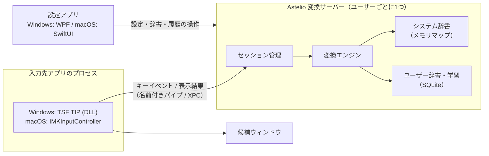
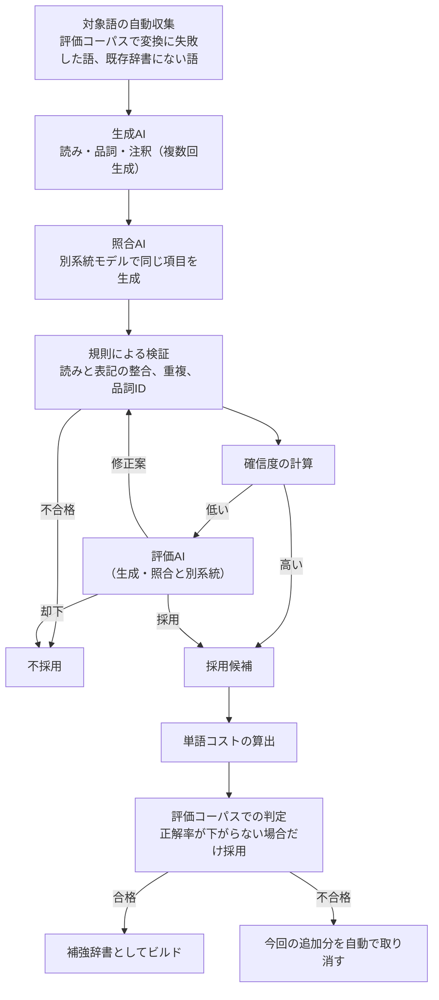

# Astelio IME 開発計画

## 1. 目的

英語配列キーボード向けの日本語入力システムとして、Astelio IMEを独自に開発する。対象はWindowsとmacOS。

現在の方式は、低レベルキーフックでキーを受け取り、変換をMS-IMEに任せている。この方式には次の構造的な限界がある。

- 半角英数字を未確定のまま保持できない（MS-IMEの半角英数モードでは入力が即時確定される）
- 未確定を維持すると英数字・記号が全角になる
- Altキーの抑制や入力モードの状態がアプリ側とずれやすい
- macOSで使えない

そこで、OS標準の入力メソッド基盤（Windows: TSF、macOS: InputMethodKit）上に独自の変換エンジンを載せる方式へ移行する。

## 2. スコープ

### 対象

| 項目 | 内容 |
| --- | --- |
| OS | Windows 11（ARM64 / x64）、macOS 14以降（Apple Silicon / Intel。2026-09-27に13から引き上げ） |
| キーボード | 英語配列（US ANSI / ISO、macOS「ABC」「U.S.」） |
| 入力方式 | ローマ字入力 |
| 言語 | 日本語（かな漢字変換） |

### 対象外

- 日本語配列（JIS）キーボード。JIS固有キー（変換・無変換・かな・英数・¥など）は扱わない
- かな入力（JISかな配列）
- Windows 10、macOS 12以前
- モバイルOS

### 方針の変更点

- 「変換エンジンはMS-IMEを利用する」という初期方針は撤回する。macOS対応と未確定状態の完全な制御のため、変換は独自エンジンで行う
- 既存のWPFアプリ（設定・トレイ常駐・初回ウィザード）は、Windows版の設定アプリとして再利用する
- 低レベルキーボードフックは廃止する

## 3. 要件

### 3.1 これまでの要件（引き継ぎ）

| ID | 要件 |
| --- | --- |
| R-01 | 日本語モードでも英字・数字・スペース・記号は既定で半角。ただし未確定文字列として保持し、変換できる |
| R-02 | Shiftで入力する記号（`+` `(` `)` `!` `?` など）が正しく入力できる |
| R-03 | 左Alt単押しで英語入力、右Alt単押しで日本語入力。Alt単押しがアプリのメニューを起動しない |
| R-04 | Altを他のキーと同時に押した場合は、通常のAltとして動作する |
| R-05 | `「」！？・。` などを半角にするか選べる（既定は全角） |
| R-06 | タスクトレイ（macOSはメニューバー）に常駐する |
| R-07 | OS起動時に自動起動できる |
| R-08 | 初回起動時にセットアップウィザードを表示する。インストーラーから同じウィザードを開き、好みの設定（切替キー、句読点・記号、もしかして、学習など）を選んで導入できる |
| R-09 | ARM64 / x64 の配布物を用意する（MITライセンス、作者 Geek Fujiwara） |
| R-10 | 入力の頭が数字だけのときに `.` を打つと、「。」ではなく「. 」（半角ピリオド＋半角スペース）にする（箇条書きの番号 `1. `）。続けて数字を打つと小数点に戻る（`3.14`）。既定はオン。設定でオフにできる |
| R-11 | 開き括弧を打つと閉じ括弧も入れ、カーソルを括弧の間に置く（「」『』（）［］｛｝()[]{}｢｣。記号の入力設定で決まる形）。閉じ括弧のキーは括弧を越えて進むだけ。空の括弧でBackSpaceを押すと両方消す。zで始まる記号（z[ → 『）はそのまま。既定はオン。設定でオフにできる |

### 3.2 IMEの基本機能

| ID | 機能 |
| --- | --- |
| B-01 | ローマ字→ひらがな変換（未確定表示、下線、カーソル移動、BackSpace/Delete）。Google日本語入力と同じzで始まる記号（zh ←、zl →、z. … など） |
| B-02 | Spaceでかな漢字変換。文節区切り、文節の伸縮（Shift+←/→）、文節間の移動。入力ミス（「っっ」「んん」など）を補正した候補も出す。文節の最後の付属語と同じ読みの漢字の接尾語があれば（「か」→「化」）、第2候補に出す（汎用か / 汎用化） |
| B-03 | 候補ウィンドウ。候補番号の選択、ページ送り。候補が9件を超えたら9件ずつの列に広げ、最大3列（27件）を一度に見せる（←→で列を移動、数字キーは今の列の1〜9、PageUp/PageDownは27件ずつ）。候補の列の右に、選んでいる候補の注釈（用法・同音異義語の説明。例: 暑い…気温が高い）の列と、文節の読みに関連する絵文字の列（最大9個。いぬ → 🐶。なければ出さない）を置く。最後の候補の列から→で絵文字の列に移り、数字キーとクリックでも選べる。注釈は辞書作成環境（4.5.1）で下書きし、照合・評価を通したものを載せる（最初はよく使う同音異義語の数百語） |
| B-04 | 予測変換（入力途中で候補を表示）。Tabで選択 |
| B-05 | F6〜F10でひらがな・カタカナ・半角カナ・全角英数・半角英数に変換 |
| B-06 | Enterで確定、Escで取り消し、一部確定（Ctrl+↓で注目文節までを確定し、残りは変換中のまま） |
| B-07 | 再変換（確定済み文字列の選択から変換し直す） |
| B-08 | 確定取り消し（確定の直後にCtrl+BackSpaceで、確定した文字列を変換中に戻す。選んだ候補と区切りも戻す。その確定で新しく覚えた入力の履歴は消す） |
| B-09 | 数字変換（漢数字、全角、桁区切り）、日付・時刻変換（「きょう」「あした」「いま」など）。日付の表記は yyyy/MM/dd、yyyy年M月d日、M月d日、M月d日(曜)、令和〇年M月d日、yyyy-MM-dd、yyyyMMdd、M/d、〇曜日。どれを最初に出すかはC-13で選ぶ |
| B-10 | 記号・絵文字・顔文字の変換（「やじるし」→「→」など） |
| B-11 | パスワード入力欄では無効化し、キーをそのままアプリに渡す（WindowsはInputScopeのパスワード・PIN、macOSはSecure Input） |
| B-12 | 入力モード表示（あ / A）。Alt単押しやタスクバーでの切替時に、入力位置の近くへ約1.2秒表示 |
| B-13 | 絵文字パレット。「えもじ」と入力するとパレットを表示し、Tab/↓で開く（Spaceでは通常どおり「絵文字」に変換する）。パレット内の読みによる検索、分類（履歴・顔・人・自然・食べ物・活動・旅行・物・記号・旗）ごとの一覧、使った絵文字の履歴（新しい順、最大32個、アプリ間で共有）。マウスでも選べる |
| B-14 | もしかして。打ち間違えた読み（「ゆーあー」→「ユーザー」など）を辞書とアルゴリズムで直し、前の文脈も使って選び、通常の候補と同じウインドウに「もしかして:」として表示する。入力中から予測候補の中にも出す（Spaceを押さなくてもよい）。SLMは使わない（4.5.2） |

### 3.3 カスタマイズ

| ID | 機能 |
| --- | --- |
| C-01 | 記号ごとの入力モード設定。各記号について「半角」「全角」「和文記号」から選ぶ（例: `[` → `「` / `［` / `[`） |
| C-02 | 句読点のスタイル（`、。` / `，．` / `,.` / `、．`） |
| C-03 | 英字・数字・スペースの半角/全角を個別に設定 |
| C-04 | ローマ字テーブルの編集（追加・削除・インポート・エクスポート）。AZIKなどの拡張入力も定義できる |
| C-05 | キー割り当ての編集。プリセット（MS-IME風、ATOK風、ことえり風）を用意 |
| C-06 | 修飾キー単押しの割り当て。Windowsは左右Alt、macOSは左右Command（どちらも変更可能） |
| C-07 | 候補ウィンドウの表示件数、フォント、サイズ、配色、縦/横 |
| C-08 | 予測変換の有効/無効、表示までの文字数、候補数 |
| C-09 | アプリごとの設定（初期モード、無効化）。無効にしたアプリでは、文字のキーもAltの単押しもそのままアプリに渡す。Windowsは設定アプリの「全般」（設定を開いたアプリの「このアプリでは使わない」）と「アプリごとの設定」で切り替え、HKCU\Software\AstelioIME の `DisabledApps`（exeのファイル名）に保存する |
| C-10 | 設定のインポート・エクスポート（別PCへの移行用） |
| C-11 | 入力補助の設定（R-10 数字の後のピリオド、R-11 括弧の自動補完）。設定アプリの「入力補助」で切り替え、HKCU\Software\AstelioIME の `ListNumberPeriod`、`AutoCloseBrackets` に保存する |
| C-12 | 設定画面の構成。機能ごとのメニュー（左のナビゲーション）から各画面を開く：入力と切替キー、記号と句読点、入力補助、変換ともしかして、ユーザー辞書、入力の履歴、アプリごとの設定、プライバシーと診断、使い方（U-03）、このアプリについて（U-04）。Windows 11のFluentの見た目（Micaの背景、角丸、ライト/ダーク・ハイコントラスト対応）。検索欄から設定項目を探せる。変更はすぐに反映し、「既定に戻す」を画面ごとに置く。WindowsはWPF（.NET 10のFluentテーマ。既存のコードとテストを活かす。2026-09-27の判断）。ランタイムを内蔵した1つのexe（`Program Files\Astelio IME\settings\AstelioSettings.exe`）にし、タスクバーの入力モードのアイコンの右クリックメニューは「設定...」だけにする（開いたアプリのexe名を `--app` で渡し、そのアプリの設定を「全般」に出す。2026-09-27の判断）。ユーザー辞書と入力の履歴の管理画面は、TIPの画面を `rundll32` で開く |
| C-13 | 日付の候補で最初に出す表記（B-09のどれか。既定は yyyy/MM/dd）。設定アプリの「変換」画面で選び、HKCU\Software\AstelioIME の `DateFormat`（yyyy/MM/dd、yyyy年M月d日、M月d日、M月d日(ddd)、令和、yyyy-MM-dd、yyyyMMdd、M/d）に保存する |
| C-14 | 入力モード（日本語 / 英語）をアプリ間で共有する（メモ帳で日本語にすると、ブラウザーも日本語になる）。既定はオン。オフにするとアプリごとに切り替える。WindowsはTSFのグローバルコンパートメント（VT_I4）で共有し、設定アプリの「全般」で切り替え、`SharedInputMode` に保存する。macOSは入力ソースが全体で共有されるので、同じ動きになる |

既定値（フェーズ1で確定）:

- 英字・数字・スペースは半角。Shift+英字で一時英数になり、確定・取り消し・Shiftの単押しで戻る
- 記号は半角。ただし `[` `]` `/` `-` `!` `?` は和文記号（「 」 ・ ー ！ ？）、`,` `.` は句読点のスタイル（既定は 、。）
- 修飾キーの単押しは、押してから離すまで1秒以内のものだけとする

### 3.4 辞書と学習

| ID | 機能 |
| --- | --- |
| D-01 | システム辞書（読み・表記・品詞・コスト） |
| D-02 | ユーザー辞書の追加・編集・削除・検索。読みがちょうど一致する文節では先頭の候補にし、文の中では名詞として扱う（短縮よみは文節全体の読みと一致したときだけ）。予測にも出す。優先順位は 抑制語 ＞ 入力の履歴（D-04）＞ ユーザー辞書 ＞ システム辞書 |
| D-03 | ユーザー辞書のインポート・エクスポート（Google日本語入力、MS-IME、ATOK、ことえりのテキスト形式、独自JSON）。形式と文字コードは中身から判定する。品詞の対応と書き出しの文字コードはテスト計画書の T-D03-1 の表。UTF-8・UTF-16はCore（`core/include/astelio/user_dictionary_io.h`）、Shift_JISはプラットフォーム側（Windowsはcode page 932）で読み書きする |
| D-04 | 自動学習（選んだ候補の順位、文節区切り、語の組み合わせ、予測候補）。選んだ候補は次から候補ウインドウの先頭に出し、履歴の印を付ける。語の組み合わせは「直前の語と読み」ごとに選んだ候補を覚え、読みだけの学習より優先する（お→箸、川の→橋）。文節区切りはShift+←/→で直して確定した区切りを読みごとに覚える |
| D-05 | 学習履歴の閲覧、個別削除、期間を指定した削除（過去1時間 / 24時間 / 7日間 / 4週間に使ったもの）、全削除。候補ウインドウでは Ctrl+Delete で選んだ候補を履歴から消す。設定アプリの「入力の履歴」で、履歴の使用の切替と、管理画面（一覧・削除・期間を指定した削除・全削除）を開くことができる |
| D-06 | 学習の一時停止（シークレットモード: 履歴は使うが記録しない）。アプリ単位でも設定できる。Windowsは設定アプリの「入力の履歴」「全般」「アプリごとの設定」で切り替え、HKCU\Software\AstelioIME の `LearningPaused`、`NoLearningApps`（exeのファイル名）に保存する |
| D-07 | 辞書の追加（専門用語など）。有効/無効、優先度を設定できる |
| D-08 | 抑制語の登録（特定の候補を表示しない）。変換・候補一覧・予測・入力の履歴による並べ替え・もしかして（B-14）のどこにも出さず、文節の最善の候補が抑制されたら次の候補を使う。読みを空にすると、どの読みでも出さない。短い語をつないで同じ表記になる場合（日本＋語＝日本語）も出さない |

### 3.5 非機能要件

| 項目 | 目標 |
| --- | --- |
| キー入力から表示まで | 16ms以内（p95） |
| 変換（10文字程度） | 30ms以内（p95） |
| 常駐メモリ | 150MB以下 |
| 起動 | 初回キー入力までに辞書を読み込み済み（メモリマップで遅延読み込み） |
| 障害時 | 変換サーバーが落ちてもアプリを巻き込まない。自動で再起動する |
| プライバシー | 入力内容を外部に送信しない。学習データは端末内に保存する。診断ログ（U-01）は同意した場合だけ端末内に記録し、入力した文字列を含めない。報告や要望は利用者が内容を確かめ、自分のブラウザーでGitHubにIssueとして送る（IMEと変換サーバーは通信しない） |
| 変換精度 | 独自の評価コーパスで文単位の正解率を測る。リリース時の目標値は評価基盤ができた段階で決める |

### 3.6 サポートとフィードバック

| ID | 機能 |
| --- | --- |
| U-01 | 診断ログと不具合の報告。インストールのウィザードで「診断ログの収集に同意しますか？」と尋ねる（既定は同意しない。設定の「プライバシーと診断」でいつでも変えられる）。同意した場合だけ、エラーを想定した箇所（辞書・設定・履歴ファイルの読み書きの失敗、TSF・COMの呼び出しの失敗、捕えた例外、変換サーバーの異常終了）で、時刻・版・場所・エラーコードを端末内のログに記録する。入力した文字列・候補・辞書の語は記録しない。変換サーバーのクラッシュは次の起動時に検出し、設定アプリが「問題を報告」を出す。報告は、環境（OSと版、CPUの種類、IMEの版、設定の要点）とログを利用者が画面で確かめてから、ブラウザーでGitHubの「不具合・クラッシュの報告」フォームを開いて起票する（長いログはクリップボードに写して貼り付ける）。IMEと変換サーバーは通信しない。TIPは入力先アプリのプロセスで動くので、プロセス全体の例外ハンドラーは設けない（アプリの動作を変えないため） |
| U-02 | 辞書への要望。「こう入力したら、こう変換してほしい」を、ユーザー辞書に登録しなくても標準辞書への追加リクエストとしてGitHubのIssueで送れる。候補ウィンドウと設定アプリから「変換の要望を送る...」を開き、読み・望む表記・今の変換結果・前後の文脈（任意）を利用者が確かめてから、ブラウザーで「辞書への要望」フォームを開く。リポジトリ側では、ワークフローが要望の形を確かめてラベルを付け（`dictionary:ready` / `dictionary:needs-info`）、確かめた要望を辞書作成環境（4.5.1）が取り込んで、照合・評価と採用の判定を通した語だけを辞書に足す |
| U-03 | 使い方ツアー。インストールの最後と、設定アプリの「使い方」から、操作する場所（タスクバーの「あ / A」、左右のAlt、候補ウィンドウ、右クリックメニューの「設定...」）を強調表示し、説明を添えて順に再生する。練習用の入力欄で実際に打って進め、いつでもやめられる・やり直せる |
| U-04 | このアプリについて。Geek Fujiwara が開発したこと、著作権（Copyright © Geek Fujiwara）とMITライセンス、同梱した第三者のデータ、GitHubのIssueで改善案を募集していることを紹介する画面。設定アプリから開く。アクリルの背景、グラデーションのロゴ、控えめな動きで、美しく先進的な印象にする（透明効果オフ・ハイコントラスト・アニメーションを減らす設定にも従う） |

## 4. アーキテクチャ

### 4.1 全体構成


```mermaid
flowchart LR
    subgraph App["入力先アプリのプロセス"]
        TIP["Windows: TSF TIP (DLL)\nmacOS: IMKInputController"]
    end
    subgraph Server["Astelio 変換サーバー（ユーザーごとに1つ）"]
        Session["セッション管理"]
        Engine["変換エンジン"]
        Dict["システム辞書\n（メモリマップ）"]
        User["ユーザー辞書・学習\n（SQLite）"]
    end
    Settings["設定アプリ\nWindows: WPF / macOS: SwiftUI"]
    Candidate["候補ウィンドウ"]

    TIP -- "キーイベント / 表示結果\n（名前付きパイプ / XPC）" --> Session
    Session --> Engine
    Engine --> Dict
    Engine --> User
    TIP --> Candidate
    Settings -- "設定・辞書・履歴の操作" --> Server
```

### 4.2 各部の役割

| 部品 | 役割 | 言語 |
| --- | --- | --- |
| Core（変換エンジン） | ローマ字変換、未確定文字列の管理、かな漢字変換、予測、学習、記号ルール | C++20（OS依存なし） |
| 変換サーバー | Coreをプロセスとして動かす。複数アプリからのセッションを管理し、学習を一か所に集める | C++20 |
| Windows TIP | TSFに登録するDLL。キー処理、未確定表示、候補ウィンドウ、モード表示 | C++20（COM / TSF） |
| macOS 入力メソッド | InputMethodKitのアプリ。キー処理と表示 | Swift + Objective-C++（Coreとの橋渡し） |
| 設定アプリ（Windows） | 既存WPFアプリを改修 | C# / .NET 10 |
| 設定アプリ（macOS） | 設定、辞書、履歴の管理 | SwiftUI |

### 4.3 変換サーバーを別プロセスにする理由

TIPは入力先アプリのプロセス内で動く。変換エンジンを同じプロセスに置くと次の問題がある。

- アプリごとに辞書を読み込み、メモリを消費する
- 学習結果がアプリ間で共有されない
- エンジンの不具合で入力先アプリが落ちる
- Windowsでは、x64エミュレーションのアプリ、ARM64のアプリ、32bitのアプリそれぞれにエンジンを載せる必要がある

別プロセスにすれば、TIPは薄い層になり、エンジンはネイティブアーキテクチャのサーバー1つで済む。

通信経路はユーザー本人のみがアクセスできるようにする（Windowsは名前付きパイプのACL、macOSはXPCのコード署名チェック）。メッセージはサイズ上限と形式を検証する。

### 4.4 変換エンジンの設計


```mermaid
flowchart LR
    Key["キー入力"] --> Romaji["ローマ字変換\n（テーブル駆動）"]
    Romaji --> Comp["未確定文字列\n（かな + 半角英数記号の混在）"]
    Comp --> Lattice["ラティス構築\n（辞書の前方一致検索）"]
    Lattice --> Viterbi["最小コスト経路の探索\n（単語コスト + 連接コスト）"]
    Viterbi --> Rerank["学習による補正"]
    Rerank --> Result["文節と候補"]
```

- 辞書: 読みで整列した配列を二分探索する（前方一致は1文字ずつ範囲を絞る）。ファイルはそのままメモリに置いて使える形式で、読み込み時にすべての位置と範囲を検証する。速度が足りなければLOUDSやダブル配列に切り替える
- 言語モデル: 品詞の連接コスト行列＋単語コスト。後で単語の2-gramを追加する
- 未確定文字列: 文字ごとに「かな」「半角英数」「全角英数」「記号」の属性を持つ。R-01の半角英数と、かな混在の変換（例: `iPhoneをかう`）はここで扱う
- 記号ルール: C-01の設定を、ローマ字変換の直後に適用する
- 学習: システム辞書は書き換えない。学習結果は別レイヤーに保存し、変換時にコストを補正する
- 予測: 入力中の読みを前方一致で検索し、ユーザー履歴＋システム辞書から候補を出す

### 4.5 辞書データ

変換精度は辞書と言語モデルの質で決まる。Astelio IME本体はMITライセンスで提供する。同梱する第三者のコード・データは、MITを優先し、MITの配布物に含められるライセンス（Apache-2.0、BSD系）に限る。

| 候補 | 用途 | ライセンス（2026-09-24確認） | 注意 |
| --- | --- | --- | --- |
| AzooKeyKanaKanjiConverter | 変換エンジンの参考実装。macOS版では直接利用も検討 | MIT | Swift製。Windows版のC++ Coreには設計を参考にする |
| azooKey_dictionary_storage | システム辞書、連接コスト | Apache-2.0 | azooKeyのバイナリ形式（LOUDSのノードごとのエントリー、品詞の連接コスト行列）。辞書ツールでAstelioの6列TSV（読み・表記・左品詞ID・右品詞ID・意味ID・コスト）に変換する。版はコミットとSHA-256で固定する。LICENSEの同梱が必要 |
| SudachiDict | 語彙の補強 | Apache-2.0 | 表記と品詞体系の変換が必要 |
| Mozcのオープンソース辞書 | 比較・評価用 | IPAdic・沖縄辞書由来の独自ライセンス（MITではない） | 同梱は保留。使う場合は著作権表示の同梱条件を満たす |
| 独自の固有名詞・新語リスト | 流行語、製品名 | 自作（MIT） | 収集方法と権利を確認する |
| 言語モデルで生成した補強辞書 | 新語、IT用語、英字混じりの語、注釈 | 自作（MIT） | 生成に使うモデルはMIT・Apache-2.0に限る（4.5.3） |

GPL系の辞書（SKK辞書の一部など）はMITと両立しないため、同梱しない。ユーザーが自分で追加辞書として取り込む機能（D-07）で対応する。

第三者のライセンスは `THIRD_PARTY_NOTICES` にまとめ、配布物（ZIP、インストーラー、アプリバンドル）に含める。

辞書のビルドは独立したツールにする（テキスト形式のソース → バイナリ辞書）。辞書の更新は、アプリ本体と切り離して配布できるようにする。

### 4.5.1 言語モデルによる辞書の補強

軽量な言語モデルは辞書を作る時だけに使い、結果を辞書として保存する。実行時は辞書を引くだけにし、推論のコストと遅延をなくす。手元のPCでモデルを動かすので、トークン料金はかからない。

辞書の補強は**人が一切介在しない完全自律の処理**とする。確信度の低い語は、生成・照合とは別系統の評価AIが判定する。評価AI自身の正確さも自動で測り、基準を下回ったら処理を止める。


```mermaid
flowchart TB
    Seed["対象語の自動収集\n評価コーパスで変換に失敗した語、既存辞書にない語"] --> Gen["生成AI\n読み・品詞・注釈（複数回生成）"]
    Gen --> Check["照合AI\n別系統モデルで同じ項目を生成"]
    Check --> Rule["規則による検証\n読みと表記の整合、重複、品詞ID"]
    Rule -- 不合格 --> Reject["不採用"]
    Rule --> Score["確信度の計算"]
    Score -- 高い --> Candidate["採用候補"]
    Score -- 低い --> Judge["評価AI\n（生成・照合と別系統）"]
    Judge -- 採用 --> Candidate
    Judge -- 修正案 --> Rule
    Judge -- 却下 --> Reject
    Candidate --> Cost["単語コストの算出"]
    Cost --> Gate["評価コーパスでの判定\n正解率が下がらない場合だけ採用"]
    Gate -- 合格 --> Build["補強辞書としてビルド"]
    Gate -- 不合格 --> Rollback["今回の追加分を自動で取り消す"]
```

**各AIの役割**

| 役割 | 担当 | 内容 |
| --- | --- | --- |
| 生成AI | 4.5.3の生成モデル | 読み・品詞・注釈を作る。同じ語を複数回生成し、結果のばらつきを確信度に使う |
| 照合AI | 4.5.3の照合モデル | 生成AIの結果を見ずに、同じ語の読み・品詞を独立に作る |
| 評価AI | 4.5.3の評価モデル | 確信度の低い語だけを判定する。「採用」「却下」「修正案」のいずれかと理由を、決められた形式で返す |

**確信度の計算**

次の値を組み合わせて0〜1の数値にする。

- 生成AIと照合AIの結果が一致するか（読み、品詞）
- 生成AIを複数回動かしたときに同じ結果が出る割合
- モデルが出力に付けた確率
- 作った語を辞書に入れて読みを変換したときに、正しい表記が候補に出るか（往復確認）

しきい値は手で決めず、下の「正解が分かっている確認用の語」で測った誤り率が目標（初期値 1%）以下になるように自動で調整する。

**評価AIの判定方法**

- まず生成AI・照合AIの結果を見せずに、評価AI自身に読みと品詞を答えさせる。次に両者の結果と比べさせ、判定と理由を返させる（他のAIの答えに引きずられないようにするため）
- 評価AIが出した修正案は、規則による検証と照合AIにもう一度かける。修正は1語につき1回までとし、それでも確信度が低ければ却下する
- 判定の形式（JSON）が崩れている場合は却下扱いにする

**人の確認の代わりになる自動の安全装置**

| 仕組み | 内容 |
| --- | --- |
| 確認用の語 | 既存のシステム辞書から無作為に選んだ正しい語と、読みや品詞をわざと壊した語を混ぜて、毎回の処理に目印なしで混入させる |
| 各AIの正確さの監視 | 確認用の語への判定から、生成AI・照合AI・評価AIそれぞれの正解率を測る |
| 自動停止 | いずれかの正解率が基準を下回ったら、その回の結果をすべて不採用にして処理を止める |
| 評価コーパスによる判定 | 追加する語をまとめて辞書に入れ、正解率が下がらない場合だけ採用する |
| 自動の取り消し | 採用後に評価コーパスの正解率が下がった場合は、生成記録をもとに該当分を取り消す |
| モデル変更時の再調整 | モデルやその版を変えたら、しきい値を調整し直すまで採用しない |

**実行の管理**

- 処理待ちの一覧を持ち、中断しても途中から再開できるようにする
- PCが使われていない時、AC電源の時だけ動かす。CPU・メモリの使用量に上限を設ける
- モデルは共通のAPI（OpenAI互換）で呼び出し、llama.cpp・Ollama・Foundry Localなどを差し替えられるようにする
- 出力は形式を強制する（llama.cppの文法指定など）。同じ入力から同じ結果が出るように、乱数の種と設定を記録する
- 学習履歴から対象語を集める場合は、本人の同意を得たうえで端末内だけで処理する

**記録**

- 補強辞書はシステム辞書とは別ファイルにし、有効/無効を切り替えられるようにする
- 各語に、使ったモデルの名前・版・ハッシュ、確信度、各AIの判定と理由を記録する

| 作業 | 担当 | 備考 |
| --- | --- | --- |
| 読みの付与 | 生成AI、照合AI | 一致しない場合は評価AIが判定する |
| 品詞の付与 | 生成AI、照合AI | 活用の種類は規則で検証する |
| 同音異義語の注釈 | 生成AI | 候補ウィンドウの説明に使う。評価AIが内容を確認する |
| 単語コスト | スコア用モデル | 文章で答えさせず、モデルが表記に付ける確率から計算する |
| 見出し語の網羅 | 自動収集 | モデルは知らない語を挙げられないため、変換の失敗などから対象語を集める |
| 連接コスト | 既存辞書 | azooKey_dictionary_storageのものを使う |

**エージェント型（品質で上回る場合のみ採用）**

標準は上記のワークフロー型とする。GitHub Copilot SDKを使ったエージェント型は、ワークフロー型が安定した後に試作し、品質で上回る場合だけ採用する。無理に組み込まない。

- エージェントに任せるのは、判断が必要な部分だけとする（変換に失敗した原因の分析と次の対象語の選定、確信度の低い語の追加調査、指示文の改善案）
- 統括するエージェントにはツール呼び出しが得意なモデルを使う。評価AIとは別のモデルにする
- 生成AI・照合AI・評価AIなどのSLMはツールの中から呼ぶ部品とし、エージェントの判断には使わない（小型モデルは多段階のツール呼び出しが苦手で、文脈の上限も小さいため）
- モデルは利用者側で指定する方式（BYOK）で、Ollama・Foundry Localなどのローカルサーバーにつなぐ。GitHubの認証は使わない

安全策。

- エージェントは候補を出すだけとする。辞書への書き込みは `submit_candidates` ツールだけから行い、形式の検証と採用判定（通常のプログラム）を必ず通す
- 評価コーパス・確認用の語・採用判定のプログラム・しきい値の計算は、エージェントから読み取り専用にする。ハッシュを記録し、変わっていたら実行を止める
- CLI標準のツール（ファイル編集、シェル実行など）はすべて無効にし、許可したツールだけを使えるようにする
- 1回の実行ごとに、ループの回数・1語あたりの試行回数・実行時間に上限を設ける。上限に達したら途中の結果を捨てて終了する
- SDKのイベント（ツール呼び出しと入出力）をすべて記録し、採用した語の根拠を後から追えるようにする
- 実行中に外部と通信しないことを確認する（BYOK利用時のテレメトリなど）
- 辞書作成環境は開発用のツールとし、IME本体の配布物には含めない（同梱されるCopilot CLIはGitHubの利用規約に従うため）

採用の判定。同じ対象語でワークフロー型とエージェント型を実行し、次の指標で比べる。確認用の語での誤り率が同等以下で、評価コーパスの改善幅が上回る場合だけエージェント型を採用する。

| 指標 | 内容 |
| --- | --- |
| 誤り率 | 確認用の語で測った、誤って採用した語の割合 |
| 改善幅 | 補強辞書を入れたときの評価コーパスの正解率の増加 |
| 採用数 | 採用された語の数 |
| 所要時間 | 1,000語あたりの処理時間 |
| 再現性 | 同じ入力で2回実行したときに採用結果が一致する割合 |

**開発の進め方（両方式共通）**

スキーマ、アプリケーション、ハーネスの実装はLLMで行い、入力（指示文）と出力を検証する。同じLLMが実装とテストを書くと同じ見落としが入るため、次のように分ける。

| 対象 | 進め方 |
| --- | --- |
| スキーマ | 辞書項目、ツールの入出力、評価AIの判定をJSON Schemaで先に決める。以後の実装とテストはこれに従う |
| 指示文 | 版を付けて管理する。変更のたびに確認用の語と評価コーパスで測り、悪化したら採用しない |
| 出力 | スキーマ検証と性質のテスト（読みはひらがなだけ、送り仮名が表記と一致する、など） |
| 受け入れテスト | 実装とは別のセッション・別のモデルで、仕様書から先に書く。実装中は変更しない |
| テストの有効性 | わざと不具合を入れて、テストが見つけられるかを確かめる（ミューテーションテスト） |

### 4.5.2 もしかしてと文脈の判断（アルゴリズム）

IME本体ではSLMを使わず、辞書とアルゴリズムだけで実装する（利用者の判断 2026-09-26。根拠は [SLMの評価結果](slm-evaluation-2026-09.md)）。SLMをパッケージに含めるオプションも用意しない。SLMは開発時の辞書作成（4.5.1）でだけ使う。

- もしかして（B-14）: 辞書が、打ったキーからキー1つの抜け・余分・隣のキー・入れ替わりを直した読みの語を候補にし（`FindTypoCandidates`）、語のコストと前の文脈で選ぶ。よくある打ち間違いの規則（f/h などローマ字のゆれ、活用の断片の除外）を打ち間違いのコーパスで確かめながら増やす
- 文脈の判断: 前の文脈（直前に確定した語）との連接コスト・共起、入力の履歴（D-04）で候補の順位を補正する。評価コーパスで正解率が下がらないものだけ採用する。直前の語は、辞書の第1候補を確定したときだけ使い、カーソルを動かすキー・フォーカスの移動・かなのままの確定で忘れる（T-B02-5）
- もしかしての表示: 文節の自立語の部分を直した語を、助詞を付けて候補の2番目に入れ、候補ウインドウをすぐに開く。打ち間違いで辞書が細かく分けた入力（`ゆーあー`）は、全体を1つの文節にする。24キーより長い語は探さない
- もしかしては読みの異なる候補なので、通常の候補とは分けて「もしかして:」の行に出す
- パスワード欄やシークレットモードでは履歴を使わず、履歴を保存しない

**負荷の目標**

| 項目 | 目標 |
| --- | --- |
| もしかしての候補生成 | 1語あたり p95 2ms以下（実測 1.7ms） |
| 常駐メモリの増加 | 辞書以外に数MB以内（履歴を含む） |

### 4.5.3 モデルの選定

選定の基準は次の3つ。

1. ライセンスがMITまたはApache-2.0で、独自の利用規約や追加条件がない（出力をMITの辞書として配布できる）
2. 日本語の性能が高い
3. 手元のPC（ARM64 / x64、16GB程度のメモリ）で動く

**候補（2026-09-24にHugging Faceのモデルページで確認）**

| モデル | 開発元 | 規模 | ライセンス | 日本語 | 役割 |
| --- | --- | --- | --- | --- | --- |
| sarashina2.2-3b-instruct-v0.1 | SB Intuitions | 3B | MIT | 日本語特化。開発元の比較では、同規模のQwen2.5-3Bやllm-jp-3-3.7bより日本語の評価が高い | **生成AIの第一候補** |
| sarashina2.2（0.5B / 1B） | SB Intuitions | 0.5B / 1B | MIT（2026-09-26にLICENSEを確認。商用利用・再配布可、利用に同意が必要な制限なし） | 同上の小型版 | 辞書作成での軽い処理の候補（IME本体では使わない） |
| llm-jp-3-3.7b-instruct / 1.8b | 国立情報学研究所 | 3.7B / 1.8B | Apache-2.0 | 日本語の学習データが多く、内訳が公開されている | **照合AIの第一候補** |
| PLaMo 2 1B | Preferred Networks | 1B | Apache-2.0 | 日英で学習。指示調整なしのベースモデル | 単語コスト算出（確率計算）の候補。Mamba系の構造のため実行環境の対応を確認する |
| gpt-oss-20b | OpenAI | 21B（動作時 3.6B） | Apache-2.0 | 多言語。16GB程度で動作。推論の強さを調整できる | **評価AIの第一候補**（確信度の低い語だけを扱うため、処理量が少なく大きめのモデルを使える） |
| Qwen3-4B | Alibaba | 4B | Apache-2.0 | 多言語。日本語特化モデルとの差は評価で確認する | 評価AIの予備（16GBのメモリがない環境向け） |
| Phi-4-mini-instruct | Microsoft | 3.8B | MIT | 日本語に対応。ただし英語中心で他言語は性能が下がると明記 | 予備 |

**採用しないもの**

| モデル | 理由 |
| --- | --- |
| Gemma 3 | Gemma独自の利用規約 |
| TinySwallow-1.5B-Instruct | 本体はApache-2.0だが、Gemmaのデータで学習されておりGemmaの規約も守る必要がある |
| Llama系とその派生モデル | Llama独自のライセンス |
| zenz-v2.5 | かな漢字変換専用で有力だが、CC BY-SA 4.0 |
| Qwen2.5-3B-Instruct | Qwen独自のライセンス（同じシリーズでも0.5B・1.5BはApache-2.0） |
| gemma-2-2b-jpn-it | Gemma独自の利用規約 |

**IME本体での利用（検討の記録）**

商用利用・再配布が可能な2B以下の8モデル（sarashina2.2 0.5B/1B、Qwen2.5 0.5B/1.5B、Qwen3 0.6B/1.7B、llm-jp-3-1.8b、RakutenAI-2.0-mini）をもしかしてで比較したが、アルゴリズムを上回らなかったため、IME本体ではSLMを使わない（[SLMの評価結果](slm-evaluation-2026-09.md)）。比較の仕組み（`slm/`、`.github/workflows/slm-eval.yml`）は手動で再実行できるように残す。

**方針**

- 辞書の補強: 生成AIにsarashina2.2-3b-instruct（MIT）、照合AIにllm-jp-3-3.7b-instruct（Apache-2.0）、評価AIにgpt-oss-20b（Apache-2.0）を使う。3つとも開発元も学習データも異なるので、誤りが重なりにくい
- IME本体: SLMは使わない（4.5.2）。開発では、辞書作成などSLMに任せられる作業を任せて、開発用の大きなモデルのトークン数を減らす
- 日本語の評価値は開発元によるもの。最終的には、読みの付与と変換の正解率を自前の評価コーパスで比較して決める
- 採用したモデルの名前・版・ライセンスは `THIRD_PARTY_NOTICES` と辞書の生成記録に残す

### 4.6 データの保存

| データ | 形式 | 場所（Windows） | 場所（macOS） |
| --- | --- | --- | --- |
| 設定 | JSON（スキーマのバージョン付き）。設定アプリ（フェーズ6）までは、TIPは `HKCU\Software\AstelioIME` の値を使う（READMEの「データと設定」） | `%APPDATA%\AstelioIME\settings.json` | `~/Library/Application Support/AstelioIME/settings.json` |
| ユーザー辞書 | テキスト（UTF-8、タブ区切りで読み・表記・品詞・コメント。最大10000語。`core/include/astelio/user_dictionary.h`） | `%APPDATA%\AstelioIME\user_dictionary.tsv` | 同上フォルダ |
| 学習履歴 | テキスト（UTF-8、タブ区切りで種類・直前の語・読み・表記・回数・順番・最後に使った時刻。最大5000件、古いものから消す。最初の形式も読める） | `%LOCALAPPDATA%\AstelioIME\learning.tsv` | 同上フォルダ |
| システム辞書 | バイナリ（読み取り専用） | インストール先 | アプリバンドル内 |
| 診断ログ（U-01、同意した場合だけ） | テキスト（UTF-8、1行1件で時刻・版・プロセスの種類・場所・エラーコード。最大256KBを超えたら古い半分を消す。入力内容は含めない） | `%LOCALAPPDATA%\AstelioIME\diagnostics.log` | 同上フォルダ |

- 既存の `%LOCALAPPDATA%\AstelioIME\settings.json` は初回起動時に移行する
- 学習履歴は変更のたびにファイル全体を一時ファイル経由で書き直すので、削除した語はファイルに残らない。複数のアプリが同じファイルを使うため、入力の始めに更新時刻を見て読み直す（フェーズ4で変換サーバーに移す）
- ユーザー辞書も学習履歴と同じ書き方・読み直し方にする（SQLiteは使わない。2026-09-27の判断: 語数が少なく、第三者のライブラリを増やさずに済む）
- パスワード欄・PIN欄（InputScope）では学習しない
- 学習データはOSのユーザー保護領域に置き、必要に応じてOSの暗号化機能（Windows DPAPI、macOS Keychainで管理する鍵）を使う

### 4.7 OSごとの注意点

**Windows**

- TIPはARM64、x64、x86の3種類のDLLが必要（ARM64版Windowsでもx64アプリ・32bitアプリがそれぞれのDLLを読み込む）
- TIPの登録はHKLMへの書き込みが必要なため、管理者権限のインストーラーで行う
- 言語プロファイルは日本語（ja-JP）として登録し、キーボード配列は英語配列を前提とする
- Alt単押しはTSFのキーイベント（`ITfKeyEventSink`）と優先キー（`ITfKeystrokeMgr::PreserveKey`）で処理する。低レベルフックは使わない
- 管理者権限のアプリ、UWPアプリ、ロック画面の入力欄で動作を確認する

**候補ウィンドウとモード表示のデザイン（両OS共通）**

- 背景はすりガラスのように背後をぼかす（Windows: ウィンドウ合成属性のアクリルぼかし（`SetWindowCompositionAttribute` の `ACCENT_ENABLE_ACRYLICBLURBEHIND`）と角丸 `DWMWA_WINDOW_CORNER_PREFERENCE`。候補ウィンドウはアクティブにならないため、非アクティブ時に単色になるDWMのシステム背景 `DWMWA_SYSTEMBACKDROP_TYPE` は代替としてだけ使う。macOS: `NSVisualEffectView`）
- 淡い半透明の地に細い縁取りと柔らかい影。選択中の候補は半透明の強調色で示す。ライト/ダークはOSの設定に合わせる
- 「透明効果」がオフの場合、ハイコントラスト、Windows 10ではぼかさず不透明の単色にする（文字の読みやすさを優先する）
- 入力先アプリのプロセス内で描画するため、描画は軽くする（ぼかしはOSに任せ、TIPは文字と強調だけを描く）

**macOS**

- InputMethodKitのアプリとして `~/Library/Input Methods` または `/Library/Input Methods` に配置する
- Universal 2（arm64 + x86_64）でビルドする
- WindowsのAltに当たるキーは左右Commandとする（左の単押しで英数、右の単押しでかな。既定はCommand、設定でOptionに変えられる。2026-09-27に決定）
- ライブ変換（Spaceなしの自動変換）には対応しない。Windowsと同じ操作にする
- 配布はDeveloper ID署名＋公証の.pkg（GitHub Releases）とMac App Storeの両方。App Store版はサンドボックスが必要なので、変換サーバーはバンドル内のXPCサービスにし、学習データはアプリグループのコンテナーに置く。入力メソッドのApp Storeでの扱い（審査の条件）はフェーズ7の始めに確かめ、難しければ.pkgを先に出す
- 開発の進め方: GitHubのmacOSランナーでビルド・テスト・署名・公証し、手元のMac（MacBook Air M1）では成果物をスクリプト（`tools/get-astelio-mac.sh`、Windowsの `Get-AstelioTip.ps1` と同じ流れ）で取得して試す。証明書と公証の認証情報はGitHubのSecretsに登録し、署名はmainとタグのビルドだけで行う（フォークからのPRでは使わない）。公開リポジトリなので、手元のMacをセルフホストランナーにはしない
- Developer ID署名と公証（Notarization）が必要
- 修飾キー単押しの検出には `flagsChanged` を使う

## 5. リポジトリ構成案

```text
C:\dev\IME
├─ core/                     C++20 変換エンジン（OS依存なし）
│  ├─ include/astelio/
│  ├─ src/
│  │  ├─ composer/           ローマ字変換、未確定文字列
│  │  ├─ converter/          ラティス、経路探索、候補
│  │  ├─ dictionary/         辞書の読み込み・検索
│  │  ├─ learning/           学習、履歴
│  │  ├─ prediction/         予測変換
│  │  └─ rules/              記号・句読点・半角全角ルール
│  └─ tests/
├─ server/                   変換サーバー（IPC、セッション管理）
├─ platform/
│  ├─ windows/
│  │  ├─ tip/                TSF TIP（ARM64 / x64 / x86）
│  │  ├─ settings/           既存WPFアプリを移設
│  │  └─ installer/          WiX インストーラー
│  └─ macos/
│     ├─ AstelioInput/       InputMethodKit アプリ
│     └─ AstelioSettings/    SwiftUI 設定アプリ
├─ dictionary/
│  ├─ sources/               辞書ソース（テキスト）
│  ├─ augment/               言語モデルによる辞書補強（生成・検証・生成記録）
│  └─ tools/                 辞書ビルダー
├─ eval/                     変換精度の評価コーパスと評価ツール
├─ docs/
└─ tools/                    ビルド・配布スクリプト
```

ビルドはCMake（core、server、辞書ツール、Windows TIP）とXcode（macOS）を使う。WPF設定アプリは引き続き `dotnet` でビルドする。

## 6. 既存コードの扱い

| 既存 | 扱い |
| --- | --- |
| `KotohaIME.Core/InputNormalizer.cs` | 記号・句読点のルールをCoreの `rules` へ移植する。テストケースも移植する |
| `KotohaIME.Core/AltPressTracker.cs` | 単押し判定のロジックをCoreへ移植する（Windows TIPとmacOSで共通化） |
| `KotohaIME.Core/ImeSettings.cs` | 設定スキーマv2の元にする。旧設定からの移行処理を書く |
| `KotohaIME.App`（WPF） | 設定アプリとして残す。キーフック（`KeyboardInterceptor`）とIME制御（`ImeController`）は削除する |
| `TrayIconService`、`StartupRegistration`、`SetupWizard` | 流用する。自動起動の対象は変換サーバーに変える |
| 既存テスト（38件） | Coreに移植できるものは移植する。WPF側は設定画面のテストとして残す |
| 名前 `KotohaIME.*` | `Astelio.*` に統一する |

## 7. 開発フェーズ

各フェーズは、動くものを作ってから次に進む。

### フェーズ0: 開発環境とリポジトリ整備

- Visual Studio Build Tools（C++、ARM64 / x64 / x86）、CMake、WiXの導入
- macOS用にXcodeの環境を用意する
- リポジトリをGitで管理し、上記の構成に整理する
- CI（Windows ARM64 / x64、macOS arm64 / x86_64）を用意する

**完了条件**: 空のCoreライブラリとテストが全アーキテクチャでビルド・実行できる。

手元にC++の開発環境がない間は、GitHub ActionsのCIでビルドとテストを確認する（Windows ARM64 / x64 / x86、macOS arm64 / x86_64）。

### フェーズ1: 未確定文字列（Core）

- ローマ字テーブル（標準のテーブル＋編集可能）
- かなと半角英数記号が混在する未確定文字列
- 記号ルール（C-01〜C-03）の移植
- 単押し判定の移植

**完了条件**: `a` → `あ`、`iPhone` → `iPhone`（半角・未確定）、`+` `(` がShiftで入る、ことを単体テストで確認できる。

### フェーズ2: Windows TIP（最小構成）

- TSF TIPの登録・解除（開発用スクリプト）
- キー処理、未確定表示、Enterで確定、Escで取り消し
- 左右Alt単押しの切替（メニューが起動しないこと）
- モード表示
- この段階ではCoreをDLL内で直接呼んでよい（サーバー化はフェーズ4）

**完了条件**: メモ帳、Edge、VS Code、Wordで、半角英数を未確定のまま入力し、ひらがなと混在させて確定できる。R-01〜R-04を満たす。ここで現在のキーフック版を置き換えられる。

### フェーズ3: かな漢字変換

- 辞書ビルダーとシステム辞書
- ラティス構築と経路探索
- 文節の区切り・伸縮・移動
- 候補ウィンドウ（Windows）
- 予測候補の基本（入力中に辞書の前方一致から表示し、Tab/↓で選ぶ。学習による予測はフェーズ5）
- 入力ミスの補正（重なった「っ」「ん」「ー」・小書きのかなを1つにした読みの語を、少し不利なコストで候補に入れる）
- F6〜F10の変換、数字・日付変換
- 評価コーパスと評価ツール（`eval/`。文正解率と上位5件の正解率を分類ごとにCIで記録し、0.5ポイント以上の悪化で失敗にする）
- 絵文字パレット（B-13。絵文字はシステム辞書に含まれるものを分類して並べる。履歴は `%LOCALAPPDATA%\AstelioIME\emoji_recent.txt`）

**完了条件**: 評価コーパスで正解率を計測できる。日常的な文章が変換できる。

### フェーズ4: 変換サーバー化

- サーバープロセス、IPC、セッション管理
- TIPを薄い層にする
- サーバーの自動起動と、落ちた場合の再起動
- サーバーのクラッシュの検出と診断ログへの記録（U-01。サーバーは自分のプロセスなので例外ハンドラーを設けられる。メモリの内容を含むダンプは作らない）
- x86 / x64 / ARM64 のTIPが同じサーバーにつながること

**完了条件**: 複数のアプリで同時に入力しても、学習と辞書が共有される。サーバーを強制終了しても入力先アプリが落ちない。

### フェーズ5: 学習・予測・ユーザー辞書

- 学習（候補順位、文節区切り、語の組み合わせ、予測）— 実装済み（TIP内で共有ファイルを使う。フェーズ4でサーバーに移す）
- 予測変換
- ユーザー辞書の追加・編集・インポート・エクスポート
- 学習履歴の閲覧・削除（個別、期間、すべて）— 実装済み。シークレットモード（履歴を使いつつ記録しない）
- 抑制語
- 言語モデルによる辞書補強のツール（4.5.1。生成・照合・評価の3つのAI、確認用の語による監視、自動停止と自動の取り消し）と、補強辞書の初版

**完了条件**: D-01〜D-08を満たす。補強辞書の有無で評価コーパスの正解率を比較できる。辞書補強が人の操作なしで最後まで実行できる。学習の有無で変換結果が変わることを自動テストで確認できる。

### フェーズ6: 設定アプリ（Windows）

- 既存WPFアプリを改修し、C-01〜C-12の画面を作る（C-12: 機能ごとのメニューとFluentの見た目）
  - 2026-09-27 着手: `platform/windows/settings/Astelio.Settings`（テストは `Astelio.Settings.Tests`）。画面は全般（開いたアプリの設定、モードの共有）・入力補助・変換（もしかして、日付の表記）・入力の履歴・ユーザー辞書・アプリごとの設定・使い方・このアプリについて。変更は HKCU\Software\AstelioIME にすぐ書き、TIPは次の入力かフォーカスの移動で読む。残り: 検索欄、C-01〜C-08の画面、設定の移行（settings.json）
- 辞書・学習履歴の管理画面
- 「プライバシーと診断」画面と「問題を報告」「変換の要望を送る」の画面（U-01、U-02。内容を確かめてからブラウザーでIssueフォームを開く）
- 使い方ツアー（U-03）と「このアプリについて」（U-04）
- 初回ウィザードの更新
- 設定変更をサーバーに即時反映

### フェーズ7: macOS版

- InputMethodKitアプリ（キー処理、未確定表示、候補ウィンドウ）
- 左右Command単押しの切替
- SwiftUIの設定アプリ
- メニューバー常駐、ログイン時の起動

**完了条件**: テキストエディット、Safari、VS Codeで、Windows版と同じ入力操作ができる。

### フェーズ8: 配布

- Windows: WiXインストーラー（MSI。ARM64版とx64版を別々に作る。TIP 3種の登録、サーバー、設定アプリ、辞書）、コード署名、アンインストール時の登録解除。同じMSIをGitHub ReleasesとMicrosoft Storeに出す（Storeは署名済みのMSIをそのまま掲載できる。TIPはMSIXでは登録できない）
- ARM64版Windows上のx64アプリに対応する（ARM64XのTIP。公開前に行う）
- プレビュー版（2026-09-27に前倒しで着手）: タグ vX.Y.Z で `.github/workflows/release.yml` がTIP 3種・辞書・MSI（ARM64 / x64）を作り、GitHub Releasesにプレリリースとして置く。MSIは `platform/windows/installer/Package.wxs`（WiX v5。`tools/Build-Installer.ps1` で版とSHA-256を固定して取得する）。TIPをregsvr32で登録し、インストールした利用者のキーボードの一覧に加え（`InstallLayoutOrTip`）、最後に使い方のページを開くことはやめた（2026-09-27、利用者の指示。インストールの途中で Web サイトのように開くのではなく、ウィザードの中で紹介する）。コード署名と変換サーバーはまだ入らない。設定アプリは `settings\AstelioSettings.exe` に入れ、スタートメニューに「Astelio IME の設定」と「Astelio IME の使い方」（設定アプリの「使い方」画面）を置く
- セットアップexe（2026-09-27、利用者の指示）: 配布の主は `AstelioIME-<版>-<arch>-setup.exe`。設定アプリ（WPF）にMSIをつなげた1つのexeで、開くとウィザード（ようこそ → できることの紹介をアニメーションで → 準備 → インストール（その間も紹介を流す）→ はじめの設定 → 完了）を出す。MSIは `MsiSetExternalUI` で進行を受け、Windows Installer の画面は管理者の確認（UAC）だけを出す。セットアップ自体は管理者で動かないので、はじめの設定は実行した利用者の HKCU に書く。使用中のファイル（TIPを読み込んだアプリ）はアプリを閉じずに再起動時に置き換え、完了の画面で再起動を案内する。失敗したときは原因とログ（`%TEMP%\AstelioIME-setup.log`、入力した文字は含まない）を示す。設定アプリをMSIに二重に入れないよう、セットアップ用のMSIは設定アプリを外部ファイルにし、セットアップが自分の前半をMSIの隣に書き出す（約65MB）。MSIだけの版（`AstelioIME-<版>-<arch>.msi`）も作り、Microsoft Storeと静かなインストールに使う
- アイコンは原子核のデザイン（3つの軌道と核、藍→紫→水色のグラデーションの地）。`tools/Generate-AppIcon.ps1` が `assets/icon/`（ICO 16〜256px、PNG 256・512px）を作る。TIPのDLLにも入れ、入力方式の一覧に出す
- MSIはウィザードの画面を持たない（ウィザードはセットアップexeが出す。MSIだけで入れるときは Windows Installer の進行状況の画面）。WiXの画面と拡張（MS-RL）は同梱の条件に合わないので使わない
- セットアップexeの「はじめの設定」で、次を選んで始められるようにする（R-08。入力の履歴、もしかして、モードの共有、入力補助、日付の表記は済み）。あとから設定アプリで変えられる
  - 日本語・英語の切替キー（左右Alt単押しなど）
  - 句読点と記号の入力（C-01〜C-03）
  - もしかしてのオン・オフ
  - 入力の履歴（学習）と予測の有効・無効
  - 入力補助（R-10 数字の後のピリオド、R-11 括弧の自動補完）
  - 診断ログの収集に同意するか（U-01。既定は同意しない。何を記録し、何を記録しないかをその場で説明する）
- ウィザードの最後に使い方ツアー（U-03）を再生する（飛ばせる）
- macOS: Universal 2のパッケージ、署名、公証（同じウィザードをSwiftUIで用意する）
- 辞書の更新配布の仕組み
- 自動更新の確認機能

### フェーズ9: 品質向上とベータ版

- 変換精度の改善（辞書、コスト、学習の調整）
- 性能の計測と改善（3.5の目標値）
- 各種アプリでの互換性確認
- 文脈の判断ともしかしてのアルゴリズムの強化（4.5.2）。打ち間違いの文例を増やして数値で追う
- 辞書作成のエージェント型（4.5.1）の試作と、ワークフロー型との比較。品質で上回らなければ採用しない
- ベータ版を配布し、変換ミスの報告を集める仕組みを用意する（入力内容は本人の操作で送る場合のみ）

## 8. テスト方針

具体的なテストケース、環境、性能目標、フェーズごとの完了条件は [astelio-ime-test-plan.md](astelio-ime-test-plan.md) にまとめる。

| 対象 | 方法 |
| --- | --- |
| Core | 単体テスト（ローマ字変換、記号ルール、単押し判定、辞書検索、経路探索、学習） |
| 変換精度 | 評価コーパス（読み→正解表記）で文単位・文節単位の正解率を計測し、CIで悪化を検知する |
| 性能 | ベンチマーク（キー処理、変換、予測、起動時間）をCIで計測する |
| 入力の頑健性 | ファジング（ランダムなキー列でクラッシュしないこと、IPCメッセージの不正値） |
| Windows TIP | テスト用アプリにTIPを読み込み、TSF経由でキーを送って未確定文字列と確定文字列を検証する。Alt単押しでメニューが起動しないことも検証する |
| macOS | XCTest（入力コントローラーの単体テスト）、UIテスト |
| 設定アプリ | 画面の操作テスト、設定の保存と移行のテスト |
| 手動確認 | 対象アプリの一覧を作り、リリースごとに確認する |

これまでの不具合（Altでメニューが起動する、半角が即時確定される、右Alt後に英語に戻る）は、すべて自動テストとして残す。

## 9. リスクと対策

| リスク | 影響 | 対策 |
| --- | --- | --- |
| 変換精度が大手IMEに届かない | 利用者が定着しない | 評価基盤を先に作り、改善を数値で追う。学習と英語配列向けの操作性で差をつける |
| 辞書・コーパスのライセンス | 配布できない | 本体はMIT。同梱物はMIT・Apache-2.0・BSD系に限り、`THIRD_PARTY_NOTICES` で管理する。GPL系は同梱しない |
| 言語モデルが誤った読み・品詞を生成する | 誤変換が辞書に固定される | 別系統の照合AIと評価AI、規則による検証、評価コーパスによる判定。生成記録をもとに自動で取り消す |
| 3つのAIがそろって同じ誤りをする（人の確認がないため気づけない） | 誤りが辞書に入る | 開発元・学習データの異なるモデルを選ぶ。確認用の語で各AIの正確さを毎回測り、基準を下回ったら自動で止める |
| モデルのライセンス変更 | 生成物の扱いが変わる | 利用時点のライセンスと版を生成記録に残す |
| TSFの互換性（アプリごとの挙動差） | 一部アプリで入力できない | 対象アプリの一覧で確認する。問題のあるアプリ用の回避設定を用意する |
| Windowsのアーキテクチャ混在 | x64・32bitアプリで使えない | TIPを3種ビルドし、CIで全種を確認する |
| コード署名・公証の費用と手続き | 配布できない、警告が出る | フェーズ8より前に証明書とApple Developer Programを用意する |
| 学習データの漏えい | プライバシー侵害 | 外部に送信しない。ユーザー領域に保存し、削除を確実に行う。パスワード欄では学習しない |
| 開発規模が大きい | 完成が遅れる | フェーズ2でキーフック版を置き換え、早い段階で日常利用できる状態にする |

## 10. 決めておくこと

開発を始める前、または該当フェーズまでに決める。

1. システム辞書に使うデータ（第一候補: azooKey_dictionary_storage。4.5参照）
2. ~~macOSで単押しに使うキーの既定値（Command / Option）~~ → Command（左=英数、右=かな。設定でOptionに変えられる。2026-09-27に決定。4.7）
3. ~~Windowsのインストーラー形式（MSI / MSIX）~~ → MSI（WiX。ARM64版とx64版を別々に。同じMSIをMicrosoft Storeにも出す。2026-09-27に決定）
4. コード署名証明書の入手方法。候補（安い順）: SignPath Foundation（オープンソースには無償。GitHub Actionsから署名。発行元の名前は SignPath Foundation になる）、Certumのオープンソース開発者向け証明書（年額が安い。名前は個人名）、Azure Artifact Signing（月額制。申し込める地域に条件がある）。フェーズ8の前に選ぶ
5. ~~変換ミスの報告機能を設けるか、設ける場合の同意の取り方~~ → 設ける（2026-09-27に決定。3.6のU-01、U-02）。診断ログはインストール時に同意を尋ね（既定は同意しない）、送るときは利用者が内容を確かめてブラウザーからGitHubのIssueを起票する
6. ~~フェーズ3以降、MS-IMEの変換結果を比較用に使うか~~ → 使わない（自前の評価だけで進める。2026-09-27に決定）
7. 辞書補強に使うモデル（第一候補: 生成AIにsarashina2.2-3b-instruct、照合AIにllm-jp-3-3.7b-instruct、評価AIにgpt-oss-20b。4.5.3参照）と、誤り率の目標（初期値 1%）
8. ~~SLMによる文脈変換を提供するか~~ → 提供しない（2026-09-26に決定。[SLMの評価結果](slm-evaluation-2026-09.md)）
9. 辞書作成にエージェント型を採用するか（フェーズ9の比較結果で決める。統括エージェントのモデルもこのとき選ぶ）
10. ~~最初の公開の形~~ → Windows版を先にベータ版（無償）として、GitHub ReleasesとMicrosoft Storeに出す。変換サーバー（フェーズ4）を入れてから出す。macOS版はその後（2026-09-27に決定）

### 10.1 Windows版の公開までの順番（2026-09-27）

1. 日付の表記（B-09、C-13）、「〜化」（B-02）、候補の3列表示（B-03）、モードの共有（C-14）
2. 候補ウィンドウの注釈の列と絵文字の列（B-03）
3. 診断ログと要望の画面（U-01、U-02）
4. 再変換（B-07）
5. 設定アプリ（C-12、C-13、U-03、U-04）
6. 変換サーバー（フェーズ4）
7. ARM64版Windowsのx64アプリ（ARM64X）
8. インストーラー、署名、Microsoft Storeへの提出（フェーズ8）
9. 公開リポジトリの整理（SECURITY.md、CONTRIBUTING.md、旧名 KotohaIME の整理など）

## 11. 最初の作業

1. Visual Studio Build Tools（C++ ARM64 / x64 / x86）とCMakeを導入する
2. Gitリポジトリを作成し、現在のコードを記録する（2026-09-24 完了。公開リポジトリ: https://github.com/geekfujiwara/japanese-input ）
3. `core/` を作り、`InputNormalizer` と `AltPressTracker` をC++へ移植し、既存テストを移植する
4. フェーズ2のWindows TIPに着手する

開発はClaude Opus 5.5で行い、作業は `.github/prompts/` のプロンプト（`/astelio-task`、`/astelio-bugfix`、`/astelio-acceptance-tests`）から始める。共通の決まりは `.github/copilot-instructions.md` と `.github/instructions/` に置く。

## 12. まだ実装していない機能と次の候補（2026-09-27時点）

これまでのPRで残った課題、実機での確認、未実施のテストは [申し送り事項](handover.md) にまとめる（2026-09-27）。

実装済み: B-01〜B-02、B-03（注釈を除く）、B-04〜B-06、B-08〜B-14（B-07を除く）、D-01〜D-06、D-08（Windows TIP）。次の順で進める案。優先度は日常の使い勝手への影響で付けた。「済」は実装した項目と、残った課題。

| 優先 | ID | 内容 | 補足 |
| --- | --- | --- | --- |
| 済 | B-11 | パスワード欄・PIN欄で日本語入力にしない | InputScopeで判定し、キーをそのままアプリに渡す |
| 済 | B-08 | 確定取り消し（確定直後のCtrl+BackSpaceで変換中に戻す） | 確定した文字列がカーソルの直前にあるときだけ消す。その確定で新しく覚えた履歴も消す（前からあった履歴の回数と順番は戻さない） |
| 済 | B-06 | 一部確定（Ctrl+↓で注目文節までを確定し、残りを変換中のまま残す） | |
| 済 | B-12 | 入力モードの切替時に、カーソルの近くへ「あ / A」を一時的に表示する | 外部からのオン・オフでは表示しない。残り: 位置と時間を実機で確認する |
| 済 | D-06 | シークレットモード（履歴を使いながら記録しない）とアプリごとの設定 | 設定アプリの「入力の履歴」「アプリごとの設定」。残り: ブラウザーのプライベートウィンドウの自動判定 |
| 済 | D-02・D-03・D-08 | ユーザー辞書（追加・編集・削除・検索、インポート・エクスポート）と抑制語 | 設定アプリの「ユーザー辞書」から開く管理画面（TIPの画面を `rundll32` で開く）。`%APPDATA%\AstelioIME\user_dictionary.tsv` に保存し、入力の始めに更新時刻と大きさを見て読み直す。Shift_JISのファイルはcode page 932で読み書きする。取り込めないファイルでは辞書を変えない。管理画面で入力した読みのカタカナはひらがなに直す。画面は入力先アプリのメッセージループで動くので、Tab・Enter・Escは入力欄ごとに受けて動かす（Enterで追加または変更、Escで閉じる。入力の履歴の画面も同じ）。残り: Shift_JISで表せない文字を含むとその形式では書き出せない、画面をWPFで作り直すか |
| 中 | B-07 | 再変換（確定済みの文字列を選んで変換し直す。TSFの `ITfFnReconversion`） | |
| 中 | B-03 | 候補の注釈（同音異義語の使い分け、「環境依存」など）の列 | 辞書に注釈の欄を足す。注釈は辞書作成環境で作る。候補の3列表示と関連する絵文字の列は済（絵文字は文節の頭の読みで辞書の絵文字を探す。最初に候補一覧を開くとき、絵文字の一覧を辞書から作る） |
| 済 | B-09・C-13 | 日付の表記 yyyy-MM-dd・yyyyMMdd・M/dと、最初に出す表記の設定 | 設定アプリの「変換」で選ぶ（`DateFormat`） |
| 済 | B-02 | 「〜化」など、付属語と同じ読みの漢字の接尾語を第2候補に出す | 第1候補はコストで決める（選べば入力の履歴で先頭になる） |
| 済 | C-14 | 入力モードのアプリ間の共有（既定はオン） | 設定アプリの「全般」で切り替える |
| 中 | — | 学習のアプリ間の即時共有 | 今は入力の始めにファイルを読み直す。フェーズ4の変換サーバーで解決する |
| 中 | — | もしかしての残りの外れ（打った読みも語になる例） | 入力の履歴と語の組み合わせで補う。組み合わせの学習を評価コーパスで測る |
| 済 | C-09 | 特定のアプリで無効にする（設定アプリの「全般」「アプリごとの設定」） | 残り: アプリごとの初期モード |
| 済 | R-10・R-11・C-11 | 数字の後のピリオドを「. 」にする、括弧を自動で閉じる（既定はどちらもオン） | 設定アプリの「入力補助」で切り替える |
| 済 | U-02 | 辞書への要望と不具合の報告を受けるGitHubのIssueフォームと、辞書の要望を確かめるワークフロー | 残り: IMEから要望を書いて開く画面（フェーズ6）、確かめた要望を辞書作成環境で取り込む処理（4.5.1） |
| 高 | U-01 | 診断ログ（同意制）と不具合の報告 | エラーを想定した箇所での記録（TIP・コア・変換サーバー）、クラッシュの検出（変換サーバー、フェーズ4）、報告画面（フェーズ6）、インストーラーでの同意（フェーズ8） |
| 中 | C-12・U-03・U-04 | 機能ごとのメニューを持つ設定画面、使い方ツアー、このアプリについて | 設定アプリと「このアプリについて」は着手済み（フェーズ6）。残り: 検索欄。使い方ツアーはセットアップと設定アプリの「使い方」でアニメーションを流す（実際のタスクバーなどを強調する形はまだ） |
| 低 | C-01〜C-10 | 設定アプリの残りの画面（フェーズ6）。切替キー、記号と句読点など | |
| 低 | R-06〜R-08 | インストーラーとウィザード（フェーズ8） | プレビュー版のセットアップexeとMSIは済（GitHub Releases。署名なし。はじめの設定を含む）。残り: 切替キー・記号の選択、診断ログの同意、署名、Microsoft Store |
| 高 | — | ARM64版Windowsのx64アプリ対応（ARM64Xの転送DLL） | 公開前に行う（10.1） |
| 低 | — | macOS版（フェーズ7） | Windows版の公開の後 |
